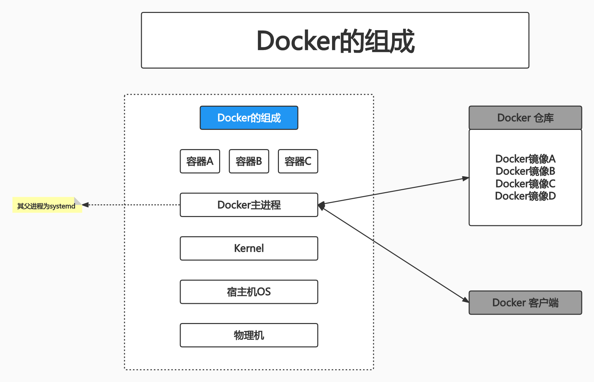
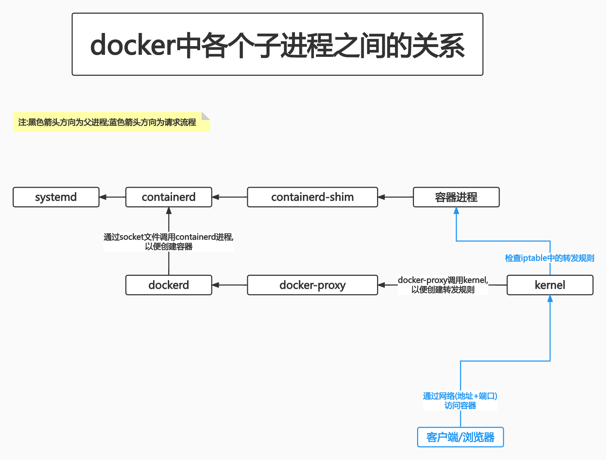
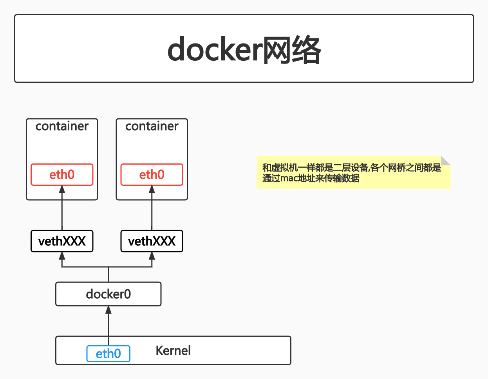

# 预习-Docker

## PART1. Docker简介

### 1.1 Docker是什么

性能上来讲,16G/条 * 8条的配置,比8G/条 * 16条,前者的性能会好一些.

[docker仓库地址](https://github.com/moby/moby)

[CHANGELOG](https://github.com/moby/moby/blob/master/CHANGELOG.md)

Docker1.11.0开始,将LXC替换为了containd和runc,这个结构直到现在仍在使用

### 1.2 Docker的组成

[docker的组成](https://docs.docker.com/get-started/overview/#docker-architecture)



### 1.3 Docker对比虚拟机

### 1.4 Linux Namespace技术

#### 1.4.1 MNT Namespace

宿主机使用`chroot`技术把容器锁定到了一个指定的运行目录中:`/var/lib/containerd/io.containerd.runtime.v1.linux/moby/容器ID`

```
root@docker-server-1:/usr/local/src# docker run -d -p 80:80 nginx
50efd7028d3f15abee9114ce8d186b42d12b26416a7ca6d02ac756168a724808
root@docker-server-1:/usr/local/src# ll /var/lib/containerd/io.containerd.runtime.v1.linux/moby/
total 12
drwx--x--x 3 root root 4096 Nov  5 20:21 ./
drwx--x--x 3 root root 4096 Nov  5 20:21 ../
drwx--x--x 2 root root 4096 Nov  5 20:21 50efd7028d3f15abee9114ce8d186b42d12b26416a7ca6d02ac756168a724808/
```

注:进入容器时,能用`bash`尽量用`bash`,因为`sh`不好用,比如按`tab`没有补全功能;`sh`命令提示符不完整等

```
root@docker-server-1:/usr/local/src# docker ps
CONTAINER ID        IMAGE               COMMAND                  CREATED             STATUS              PORTS                NAMES
50efd7028d3f        nginx               "/docker-entrypoint.…"   6 minutes ago       Up 6 minutes        0.0.0.0:80->80/tcp   practical_wozniak
root@docker-server-1:/usr/local/src# docker exec -it 50efd7028d3f bash
root@50efd7028d3f:/# cat /etc/issue
Debian GNU/Linux 11 \n \l
```

可以看到,这个官方的Nginx镜像是基于Debian制作的.

在容器内安装命令(容器删除后这个操作会失效的):

由于本例中Nginx镜像是基于Debian的,因此要使用`apt`命令安装软件包

- step1. `apt update`

注:这一步不做的话,直接安装命令会报错

```
root@50efd7028d3f:/# apt update
Get:1 http://deb.debian.org/debian bullseye InRelease [116 kB]
Get:2 http://deb.debian.org/debian-security bullseye-security InRelease [48.4 kB]
Get:3 http://deb.debian.org/debian bullseye-updates InRelease [44.1 kB]
Get:4 http://deb.debian.org/debian bullseye/main amd64 Packages [8184 kB]
Get:5 http://deb.debian.org/debian-security bullseye-security/main amd64 Packages [194 kB]                             
Get:6 http://deb.debian.org/debian bullseye-updates/main amd64 Packages [14.6 kB]                                      
Fetched 8600 kB in 26s (328 kB/s)                                                                                      
Reading package lists... Done
Building dependency tree... Done
Reading state information... Done
2 packages can be upgraded. Run 'apt list --upgradable' to see them.
```

- step2. 安装`procps`包(ps命令)

```
root@50efd7028d3f:/# apt install procps
Reading package lists... Done
Building dependency tree... Done
Reading state information... Done
The following additional packages will be installed:
  libgpm2 libncurses6 libncursesw6 libprocps8 psmisc
Suggested packages:
  gpm
...
Processing triggers for libc-bin (2.31-13+deb11u5) ...
```

测试:

```
root@50efd7028d3f:/# ps
  PID TTY          TIME CMD
   39 pts/0    00:00:00 bash
  387 pts/0    00:00:00 ps
```

```
root@50efd7028d3f:/# ps -ef|grep nginx
root         1     0  0 12:21 ?        00:00:00 nginx: master process nginx -g daemon off;
nginx       28     1  0 12:21 ?        00:00:00 nginx: worker process
root       516    39  0 12:47 pts/0    00:00:00 grep nginx
```

可以看到,nginx的master进程是PID为1的进程;其子进程(worker进程)的PID为28

**每个容器中都有一个PID为1的进程用于维持容器的运行**

- step3. 安装`iputils-ping`包(ping命令)

```
root@50efd7028d3f:/# apt install iputils-ping -y
Reading package lists... Done
Building dependency tree... Done
Reading state information... Done
The following additional packages will be installed:
  libcap2 libcap2-bin libpam-cap
...
Processing triggers for libc-bin (2.31-13+deb11u5) ...
```

测试

```
root@50efd7028d3f:/# ping 192.168.0.212
PING 192.168.0.212 (192.168.0.212) 56(84) bytes of data.
64 bytes from 192.168.0.212: icmp_seq=1 ttl=63 time=1.93 ms
64 bytes from 192.168.0.212: icmp_seq=2 ttl=63 time=0.306 ms
^C
--- 192.168.0.212 ping statistics ---
2 packets transmitted, 2 received, 0% packet loss, time 1002ms
rtt min/avg/max/mdev = 0.306/1.116/1.926/0.810 ms
```

- step4. 安装`net-tools`包(网络工具)

```
root@50efd7028d3f:/# apt install net-tools -y
Reading package lists... Done
Building dependency tree... Done
Reading state information... Done
The following NEW packages will be installed:
  net-tools
...
Setting up net-tools (1.60+git20181103.0eebece-1) ...
```

测试:

```
root@50efd7028d3f:/# netstat
Active Internet connections (w/o servers)
Proto Recv-Q Send-Q Local Address           Foreign Address         State      
tcp        0      0 50efd7028d3f:53088      151.101.78.132:80       TIME_WAIT  
Active UNIX domain sockets (w/o servers)
Proto RefCnt Flags       Type       State         I-Node   Path
unix  3      [ ]         STREAM     CONNECTED     42648    
unix  3      [ ]         STREAM     CONNECTED     42647  
```

#### 1.4.2 IPC Namespace

#### 1.4.3 UTS Namespace

#### 1.4.4 PID Namespace

##### 1.4.4.1 查看宿主机上的PID信息

容器的PID和宿主机的PID之间是有关系的.还是以这个nginx的容器为例,在宿主机上查看nginx的进程信息:

```
root@docker-server-1:/usr/local/src# ps -ef|grep nginx
root     15718 15691  0 20:21 ?        00:00:00 nginx: master process nginx -g daemon off;
systemd+ 15778 15718  0 20:21 ?        00:00:00 nginx: worker process
root     16464 15933  0 21:01 pts/0    00:00:00 grep --color=auto nginx
```

可以看到nginx的master进程的PID为15718;其父进程的PID为15691;其子进程的PID为15778.

那么,PID为15691的进程是谁呢?

```
root@docker-server-1:/usr/local/src# ps -ef|grep 15691
root     15691 15194  0 20:21 ?        00:00:00 containerd-shim -namespace moby -workdir /var/lib/containerd/io.containerd.runtime.v1.linux/moby/50efd7028d3f15abee9114ce8d186b42d12b26416a7ca6d02ac756168a724808 -address /run/containerd/containerd.sock -containerd-binary /usr/bin/containerd -runtime-root /var/run/docker/runtime-runc
root     15718 15691  0 20:21 ?        00:00:00 nginx: master process nginx -g daemon off;
root     16471 15933  0 21:05 pts/0    00:00:00 grep --color=auto 15691
```

可以看到,是一个名为`containerd-shim`的进程,该进程是一个沙箱,是容器的运行环境.在本例中,nginx容器的运行环境,就被锁定在该进程中了.

那么,`containerd-shim`的父进程又是谁呢?

可以看到,`containerd-shim`的父进程就是`containerd`了.同时看到`containerd`进程的父进程PID为0,即`systemd`进程了

```
root@docker-server-1:/usr/local/src# ps -ef|grep 15194
root     15194     1  0 20:16 ?        00:00:03 /usr/bin/containerd
root     15691 15194  0 20:21 ?        00:00:00 containerd-shim -namespace moby -workdir /var/lib/containerd/io.containerd.runtime.v1.linux/moby/50efd7028d3f15abee9114ce8d186b42d12b26416a7ca6d02ac756168a724808 -address /run/containerd/containerd.sock -containerd-binary /usr/bin/containerd -runtime-root /var/run/docker/runtime-runc
root     16473 15933  0 21:05 pts/0    00:00:00 grep --color=auto 15194
```

```
root@docker-server-1:/usr/local/src# pstree -p 1
systemd(1)─┬─VGAuthService(505)
           ├─accounts-daemon(519)─┬─{accounts-daemon}(524)
           │                      └─{accounts-daemon}(543)
           ├─agetty(697)
           ├─atd(516)
           ├─chronyd(545)
           ├─containerd(15194)─┬─containerd-shim(15691)─┬─nginx(15718)───nginx(15778)
           │                   │                        ├─{containerd-shim}(15692)
           │                   │                        ├─{containerd-shim}(15693)
           │                   │                        ├─{containerd-shim}(15694)
           │                   │                        ├─{containerd-shim}(15695)
           │                   │                        ├─{containerd-shim}(15696)
           │                   │                        ├─{containerd-shim}(15697)
           │                   │                        ├─{containerd-shim}(15699)
           │                   │                        ├─{containerd-shim}(15745)
           │                   │                        └─{containerd-shim}(15780)
           │                   ├─{containerd}(15197)
           │                   ├─{containerd}(15198)
           │                   ├─{containerd}(15199)
           │                   ├─{containerd}(15200)
           │                   ├─{containerd}(15202)
           │                   ├─{containerd}(15207)
           │                   ├─{containerd}(15219)
           │                   ├─{containerd}(15220)
           │                   └─{containerd}(15221)
           ├─cron(551)
...
```

使用`pstree`命令,查看`dockerd`进程及其子进程:

```
root@docker-server-1:/usr/local/src# pstree -p 1
systemd(1)─┬─VGAuthService(505)
           ├─accounts-daemon(519)─┬─{accounts-daemon}(524)
           │                      └─{accounts-daemon}(543)
           ├─agetty(697)
           ├─atd(516)
           ├─chronyd(545)
           ├─containerd(15194)─┬─containerd-shim(15691)─┬─nginx(15718)───nginx(15778)
           │                   │                        ├─{containerd-shim}(15692)
           │                   │                        ├─{containerd-shim}(15693)
           │                   │                        ├─{containerd-shim}(15694)
           │                   │                        ├─{containerd-shim}(15695)
           │                   │                        ├─{containerd-shim}(15696)
           │                   │                        ├─{containerd-shim}(15697)
           │                   │                        ├─{containerd-shim}(15699)
           │                   │                        ├─{containerd-shim}(15745)
           │                   │                        └─{containerd-shim}(15780)
           │                   ├─{containerd}(15197)
           │                   ├─{containerd}(15198)
           │                   ├─{containerd}(15199)
           │                   ├─{containerd}(15200)
           │                   ├─{containerd}(15202)
           │                   ├─{containerd}(15207)
           │                   ├─{containerd}(15219)
           │                   ├─{containerd}(15220)
           │                   └─{containerd}(15221)
           ├─cron(551)
           ├─dbus-daemon(531)
           ├─dockerd(15440)─┬─docker-proxy(15684)─┬─{docker-proxy}(15685)
           │                │                     ├─{docker-proxy}(15686)
           │                │                     ├─{docker-proxy}(15687)
           │                │                     ├─{docker-proxy}(15688)
           │                │                     └─{docker-proxy}(15689)
           │                ├─{dockerd}(15441)
           │                ├─{dockerd}(15442)
           │                ├─{dockerd}(15443)
           │                ├─{dockerd}(15444)
           │                ├─{dockerd}(15451)
           │                ├─{dockerd}(15455)
           │                ├─{dockerd}(15469)
           │                ├─{dockerd}(15615)
           │                └─{dockerd}(15736)
...
```

注意此时`dockerd`进程下,有1个`docker-proxy`的子进程.

查看宿主机的iptables转发规则:

```
root@docker-server-1:/usr/local/src# iptables -t nat -vnL
Chain PREROUTING (policy ACCEPT 192 packets, 28964 bytes)
 pkts bytes target     prot opt in     out     source               destination         
    4   256 DOCKER     all  --  *      *       0.0.0.0/0            0.0.0.0/0            ADDRTYPE match dst-type LOCAL

Chain INPUT (policy ACCEPT 180 packets, 28207 bytes)
 pkts bytes target     prot opt in     out     source               destination         

Chain OUTPUT (policy ACCEPT 268 packets, 20293 bytes)
 pkts bytes target     prot opt in     out     source               destination         
    0     0 DOCKER     all  --  *      *       0.0.0.0/0           !127.0.0.0/8          ADDRTYPE match dst-type LOCAL

Chain POSTROUTING (policy ACCEPT 270 packets, 20421 bytes)
 pkts bytes target     prot opt in     out     source               destination         
   12   757 MASQUERADE  all  --  *      !docker0  172.17.0.0/16        0.0.0.0/0           
    0     0 MASQUERADE  tcp  --  *      *       172.17.0.2           172.17.0.2           tcp dpt:80

Chain DOCKER (2 references)
 pkts bytes target     prot opt in     out     source               destination         
    0     0 RETURN     all  --  docker0 *       0.0.0.0/0            0.0.0.0/0           
    2   128 DNAT       tcp  --  !docker0 *       0.0.0.0/0            0.0.0.0/0            tcp dpt:80 to:172.17.0.2:80
```

注意`Chain DOCKER`的部分,可以看到有一条将宿主机的80端口转发到172.17.0.2的80端口的转发规则.这个转发规则就是将流量从宿主机转发至容器的规则.

此时再起一个容器,然后再使用`pstree`命令,查看`dockerd`进程及其子进程(注意之前已经起了一个nginx容器了)

```
root@docker-server-1:/usr/local/src# docker run -d -p 81:80 nginx
2c4c2e1676af70df678a971f9b487e0f6d39a321cbb29db9ec78054761c47d44
```

```
root@docker-server-1:/usr/local/src# pstree -p 1
systemd(1)─┬─VGAuthService(505)
           ├─accounts-daemon(519)─┬─{accounts-daemon}(524)
           │                      └─{accounts-daemon}(543)
           ├─agetty(697)
           ├─atd(516)
           ├─chronyd(545)
           ├─containerd(15194)─┬─containerd-shim(15691)─┬─nginx(15718)───nginx(15778)
           │                   │                        ├─{containerd-shim}(15692)
           │                   │                        ├─{containerd-shim}(15693)
           │                   │                        ├─{containerd-shim}(15694)
           │                   │                        ├─{containerd-shim}(15695)
           │                   │                        ├─{containerd-shim}(15696)
           │                   │                        ├─{containerd-shim}(15697)
           │                   │                        ├─{containerd-shim}(15699)
           │                   │                        ├─{containerd-shim}(15745)
           │                   │                        └─{containerd-shim}(15780)
           │                   ├─containerd-shim(16964)─┬─nginx(16991)───nginx(17046)
           │                   │                        ├─{containerd-shim}(16965)
           │                   │                        ├─{containerd-shim}(16966)
           │                   │                        ├─{containerd-shim}(16967)
           │                   │                        ├─{containerd-shim}(16968)
           │                   │                        ├─{containerd-shim}(16969)
           │                   │                        ├─{containerd-shim}(16970)
           │                   │                        ├─{containerd-shim}(16971)
           │                   │                        ├─{containerd-shim}(16973)
           │                   │                        └─{containerd-shim}(17012)
           │                   ├─{containerd}(15197)
           │                   ├─{containerd}(15198)
           │                   ├─{containerd}(15199)
           │                   ├─{containerd}(15200)
           │                   ├─{containerd}(15202)
           │                   ├─{containerd}(15207)
           │                   ├─{containerd}(15219)
           │                   ├─{containerd}(15220)
           │                   └─{containerd}(15221)
           ├─cron(551)
           ├─dbus-daemon(531)
           ├─dockerd(15440)─┬─docker-proxy(15684)─┬─{docker-proxy}(15685)
           │                │                     ├─{docker-proxy}(15686)
           │                │                     ├─{docker-proxy}(15687)
           │                │                     ├─{docker-proxy}(15688)
           │                │                     └─{docker-proxy}(15689)
           │                ├─docker-proxy(16958)─┬─{docker-proxy}(16959)
           │                │                     ├─{docker-proxy}(16960)
           │                │                     ├─{docker-proxy}(16961)
           │                │                     ├─{docker-proxy}(16962)
           │                │                     └─{docker-proxy}(16963)
           │                ├─{dockerd}(15441)
           │                ├─{dockerd}(15442)
           │                ├─{dockerd}(15443)
           │                ├─{dockerd}(15444)
           │                ├─{dockerd}(15451)
           │                ├─{dockerd}(15455)
           │                ├─{dockerd}(15469)
           │                ├─{dockerd}(15615)
           │                └─{dockerd}(15736)
```

可以看到此时`dockerd`进程下有2个`docker-proxy`子进程,每个子进程负责维护1个容器的网络转发规则

再次查看宿主机的iptables转发规则:

```
root@docker-server-1:/usr/local/src# iptables -t nat -vnL
Chain PREROUTING (policy ACCEPT 2 packets, 290 bytes)
 pkts bytes target     prot opt in     out     source               destination         
    4   256 DOCKER     all  --  *      *       0.0.0.0/0            0.0.0.0/0            ADDRTYPE match dst-type LOCAL

Chain INPUT (policy ACCEPT 2 packets, 290 bytes)
 pkts bytes target     prot opt in     out     source               destination         

Chain OUTPUT (policy ACCEPT 10 packets, 760 bytes)
 pkts bytes target     prot opt in     out     source               destination         
    0     0 DOCKER     all  --  *      *       0.0.0.0/0           !127.0.0.0/8          ADDRTYPE match dst-type LOCAL

Chain POSTROUTING (policy ACCEPT 10 packets, 760 bytes)
 pkts bytes target     prot opt in     out     source               destination         
   12   757 MASQUERADE  all  --  *      !docker0  172.17.0.0/16        0.0.0.0/0           
    0     0 MASQUERADE  tcp  --  *      *       172.17.0.2           172.17.0.2           tcp dpt:80
    0     0 MASQUERADE  tcp  --  *      *       172.17.0.3           172.17.0.3           tcp dpt:80

Chain DOCKER (2 references)
 pkts bytes target     prot opt in     out     source               destination         
    0     0 RETURN     all  --  docker0 *       0.0.0.0/0            0.0.0.0/0           
    2   128 DNAT       tcp  --  !docker0 *       0.0.0.0/0            0.0.0.0/0            tcp dpt:80 to:172.17.0.2:80
    0     0 DNAT       tcp  --  !docker0 *       0.0.0.0/0            0.0.0.0/0            tcp dpt:81 to:172.17.0.3:80
```

注:如果此时`iptables -t nat -f`删除iptables中的所有转发规则,那么就无法通过网络访问到容器了.但是重新运行容器的话,就会创建新的转发规则.

docker是如何调用containerd的呢?

查看docker的service文件:

```
root@docker-server-1:/usr/local/src# cat /lib/systemd/system/docker.service
[Unit]
Description=Docker Application Container Engine
Documentation=https://docs.docker.com
BindsTo=containerd.service
After=network-online.target firewalld.service containerd.service
Wants=network-online.target
Requires=docker.socket

[Service]
Type=notify
# the default is not to use systemd for cgroups because the delegate issues still
# exists and systemd currently does not support the cgroup feature set required
# for containers run by docker
ExecStart=/usr/bin/dockerd -H fd:// --containerd=/run/containerd/containerd.sock
ExecReload=/bin/kill -s HUP $MAINPID
TimeoutSec=0
RestartSec=2
Restart=always

# Note that StartLimit* options were moved from "Service" to "Unit" in systemd 229.
# Both the old, and new location are accepted by systemd 229 and up, so using the old location
# to make them work for either version of systemd.
StartLimitBurst=3

# Note that StartLimitInterval was renamed to StartLimitIntervalSec in systemd 230.
# Both the old, and new name are accepted by systemd 230 and up, so using the old name to make
# this option work for either version of systemd.
StartLimitInterval=60s

# Having non-zero Limit*s causes performance problems due to accounting overhead
# in the kernel. We recommend using cgroups to do container-local accounting.
LimitNOFILE=infinity
LimitNPROC=infinity
LimitCORE=infinity

# Comment TasksMax if your systemd version does not support it.
# Only systemd 226 and above support this option.
TasksMax=infinity

# set delegate yes so that systemd does not reset the cgroups of docker containers
Delegate=yes

# kill only the docker process, not all processes in the cgroup
KillMode=process

[Install]
WantedBy=multi-user.target
```

注意`ExecStart`部分,可以看到是通过containerd的socket文件调用containerd的,对containerd的操作不需要我们手动去做.



#### 1.4.5 Net Namespace

每个容器有自己的网卡(eth0),有的容器甚至会有2块网卡(eth1),当然这种情况很少见,通常每个容器都是只有1个地址的.若要给容器设置多网络,只需在宿主机上添加静态路由即可.

虚拟机若要和宿主机在同一个网段上,则一定要使用桥接模式.和虚拟机一样,Docker也会创建虚拟网卡,只不过容器的虚拟网卡是成对出现的,一个是容器中的eth0网卡,另一个是宿主机上的vethXXX(XXX表示容器ID的前7位)

查看宿主机上的网桥信息和网络信息:

```
root@docker-server-1:/usr/local/src# brctl show
bridge name	bridge id		STP enabled	interfaces
docker0		8000.02429c63c53c	no		veth56e8ce9
							            vethac2bc35
```

注:该命令需要`apt install bridge-utils`

```
root@docker-server-1:/usr/local/src# ifconfig
docker0: flags=4163<UP,BROADCAST,RUNNING,MULTICAST>  mtu 1500
        inet6 fe80::42:9cff:fe63:c53c  prefixlen 64  scopeid 0x20<link>
        ether 02:42:9c:63:c5:3c  txqueuelen 0  (Ethernet)
        RX packets 4291  bytes 251240 (251.2 KB)
        RX errors 0  dropped 0  overruns 0  frame 0
        TX packets 5512  bytes 10826255 (10.8 MB)
        TX errors 0  dropped 0 overruns 0  carrier 0  collisions 0

eth0: flags=4163<UP,BROADCAST,RUNNING,MULTICAST>  mtu 1500
        inet 192.168.0.211  netmask 255.255.255.0  broadcast 192.168.0.255
        inet6 fe80::20c:29ff:fe3c:496c  prefixlen 64  scopeid 0x20<link>
        ether 00:0c:29:3c:49:6c  txqueuelen 1000  (Ethernet)
        RX packets 110744  bytes 153738641 (153.7 MB)
        RX errors 0  dropped 0  overruns 0  frame 0
        TX packets 43248  bytes 3757551 (3.7 MB)
        TX errors 0  dropped 0 overruns 0  carrier 0  collisions 0

eth1: flags=4163<UP,BROADCAST,RUNNING,MULTICAST>  mtu 1500
        inet 172.16.1.211  netmask 255.255.255.0  broadcast 172.16.1.255
        inet6 fe80::20c:29ff:fe3c:4976  prefixlen 64  scopeid 0x20<link>
        ether 00:0c:29:3c:49:76  txqueuelen 1000  (Ethernet)
        RX packets 0  bytes 0 (0.0 B)
        RX errors 0  dropped 0  overruns 0  frame 0
        TX packets 35  bytes 2642 (2.6 KB)
        TX errors 0  dropped 0 overruns 0  carrier 0  collisions 0

lo: flags=73<UP,LOOPBACK,RUNNING>  mtu 65536
        inet 127.0.0.1  netmask 255.0.0.0
        inet6 ::1  prefixlen 128  scopeid 0x10<host>
        loop  txqueuelen 1000  (Local Loopback)
        RX packets 119  bytes 12009 (12.0 KB)
        RX errors 0  dropped 0  overruns 0  frame 0
        TX packets 119  bytes 12009 (12.0 KB)
        TX errors 0  dropped 0 overruns 0  carrier 0  collisions 0

veth56e8ce9: flags=4163<UP,BROADCAST,RUNNING,MULTICAST>  mtu 1500
        inet6 fe80::b472:52ff:fe0e:21de  prefixlen 64  scopeid 0x20<link>
        ether b6:72:52:0e:21:de  txqueuelen 0  (Ethernet)
        RX packets 0  bytes 0 (0.0 B)
        RX errors 0  dropped 0  overruns 0  frame 0
        TX packets 15  bytes 1146 (1.1 KB)
        TX errors 0  dropped 0 overruns 0  carrier 0  collisions 0

vethac2bc35: flags=4163<UP,BROADCAST,RUNNING,MULTICAST>  mtu 1500
        inet6 fe80::dcd9:63ff:fef2:d432  prefixlen 64  scopeid 0x20<link>
        ether de:d9:63:f2:d4:32  txqueuelen 0  (Ethernet)
        RX packets 4291  bytes 311314 (311.3 KB)
        RX errors 0  dropped 0  overruns 0  frame 0
        TX packets 5545  bytes 10828757 (10.8 MB)
        TX errors 0  dropped 0 overruns 0  carrier 0  collisions 0
```

网桥docker0下会有很多接口,每个接口都是一个虚拟网卡,虚拟网卡的一端在宿主机上,另一端是容器的eth0



在容器A上ping容器B:

```
root@50efd7028d3f:/# ping 172.17.0.3
PING 172.17.0.3 (172.17.0.3) 56(84) bytes of data.
64 bytes from 172.17.0.3: icmp_seq=1 ttl=64 time=0.288 ms
64 bytes from 172.17.0.3: icmp_seq=2 ttl=64 time=0.087 ms
^C
--- 172.17.0.3 ping statistics ---
```

然后查看本地的路由表信息:

```
root@50efd7028d3f:/# arp -a
? (172.17.0.3) at 02:42:ac:11:00:03 [ether] on eth0
? (172.17.0.1) at <incomplete> on eth0
```

可以看到,对端容器的mac地址信息已经被记录在本地了

#### 1.4.6 User Namespace

在容器A内创建一个目录并在该目录下写入一些内容:

```
root@docker-server-1:/usr/local/src# docker exec -it 50efd7028d3f bash
root@50efd7028d3f:/# mkdir /opt/data
root@50efd7028d3f:/# echo "123" >> /opt/data/test.txt
root@50efd7028d3f:/# cat /opt/data/test.txt
123
```

在容器B内查看:

```
root@docker-server-1:/usr/local/src# docker exec -it 2c4c2e1676af bash
root@2c4c2e1676af:/# ls -l /opt/
total 0
```

但是在宿主机上查看,这个文件是存在的:

```
root@docker-server-1:/usr/local/src# find / -name test.txt
/var/lib/docker/overlay2/d21ea968e8dc55ae67dda8352f8c1a057c58ea3df2b72f5bc2104c3fda65f7ba/merged/opt/data/test.txt
/var/lib/docker/overlay2/d21ea968e8dc55ae67dda8352f8c1a057c58ea3df2b72f5bc2104c3fda65f7ba/diff/opt/data/test.txt
```

容器的所有文件和数据在宿主机中都被保存起来了

### 1.5 Linux control groups

#### 1.5.1 验证系统cgroups

##### 1.5.1.1 Centos7.6 cgroups

`cat /boot/config-3.10.0-957.el7.x86_64`

##### 1.5.1.2 ubuntu cgroups

```
root@docker-server-1:/usr/local/src# cat /boot/config-4.15.0-112-generic|grep -i cgroup
CONFIG_CGROUPS=y
CONFIG_BLK_CGROUP=y
# CONFIG_DEBUG_BLK_CGROUP is not set
CONFIG_CGROUP_WRITEBACK=y
CONFIG_CGROUP_SCHED=y
CONFIG_CGROUP_PIDS=y		# 进程限制
CONFIG_CGROUP_RDMA=y
CONFIG_CGROUP_FREEZER=y
CONFIG_CGROUP_HUGETLB=y
CONFIG_CGROUP_DEVICE=y		# 硬件的限制
CONFIG_CGROUP_CPUACCT=y
CONFIG_CGROUP_PERF=y
CONFIG_CGROUP_BPF=y
# CONFIG_CGROUP_DEBUG is not set
CONFIG_SOCK_CGROUP_DATA=y
CONFIG_NETFILTER_XT_MATCH_CGROUP=m
CONFIG_NET_CLS_CGROUP=m
CONFIG_CGROUP_NET_PRIO=y
CONFIG_CGROUP_NET_CLASSID=y
```

cgourps对内存的限制是不在上述配置项中的.

##### 1.5.1.3 cgroups中内存模块

cgourps对内存的限制:

```
root@docker-server-1:/usr/local/src# cat /boot/config-4.15.0-112-generic|grep -i memcg
CONFIG_MEMCG=y		# 对物理内存的限制
CONFIG_MEMCG_SWAP=y	# 对交换分区的限制
# CONFIG_MEMCG_SWAP_ENABLED is not set
CONFIG_SLUB_MEMCG_SYSFS_ON=y
```

注:memcg即memory control groups的简称

##### 1.5.1.4 cgroups具体实现

##### 1.5.1.5 查看系统cgroups

```
root@docker-server-1:/usr/local/src# ll /sys/fs/cgroup/
total 0
drwxr-xr-x 15 root root 380 Nov  5 19:41 ./
drwxr-xr-x 10 root root   0 Nov  5 19:41 ../
dr-xr-xr-x  5 root root   0 Nov  5 19:41 blkio/
lrwxrwxrwx  1 root root  11 Nov  5 19:41 cpu -> cpu,cpuacct/
lrwxrwxrwx  1 root root  11 Nov  5 19:41 cpuacct -> cpu,cpuacct/
dr-xr-xr-x  5 root root   0 Nov  5 19:41 cpu,cpuacct/
dr-xr-xr-x  3 root root   0 Nov  5 19:41 cpuset/
dr-xr-xr-x  5 root root   0 Nov  5 19:41 devices/
dr-xr-xr-x  3 root root   0 Nov  5 19:41 freezer/
dr-xr-xr-x  3 root root   0 Nov  5 19:41 hugetlb/
dr-xr-xr-x  5 root root   0 Nov  5 19:41 memory/
lrwxrwxrwx  1 root root  16 Nov  5 19:41 net_cls -> net_cls,net_prio/
dr-xr-xr-x  3 root root   0 Nov  5 19:41 net_cls,net_prio/
lrwxrwxrwx  1 root root  16 Nov  5 19:41 net_prio -> net_cls,net_prio/
dr-xr-xr-x  3 root root   0 Nov  5 19:41 perf_event/
dr-xr-xr-x  5 root root   0 Nov  5 19:41 pids/
dr-xr-xr-x  2 root root   0 Nov  5 19:41 rdma/
dr-xr-xr-x  6 root root   0 Nov  5 19:41 systemd/
dr-xr-xr-x  5 root root   0 Nov  5 19:41 unified/
```

### 1.6 容器管理工具

#### 1.6.1 LXC

#### 1.6.2 docker

docker镜像本质上就是一个压缩文件,可以使用`tar`命令解压缩

Docker的镜像是分层的,镜像底层为库文件且只读层既不能写入也不能删除数
据,从镜像加载启动为一个容器后会生成一个可写层(这个可写层在宿主机中以目录的形式存在),其写入的数据会复制到容
器目录,但是容器内的数据在删除容器后也会被随之删除

COW:copy on write,在容器内所做的所有变更,都不会直接写入到镜像的压缩文件中,而是写到了另外一个目录中.简单理解就是写数据的同时把数据复制到另外一个目录

#### 1.6.3 pouch

### 1.7 Docker的优势

### 1.8 Docker的缺点

安全性不如虚拟机.假设以root身份创建了一个容器,处于docker用户组内的普通用户,同样可以删除这个容器.所以安全性(也可以说是隔离性)不如虚拟机

### 1.9 docker的核心技术

#### 1.9.1 容器规范

##### 1.9.1.1 容器runtime(runtime spec)

runtime以json格式保存在`/run/docker/runtime-runc/moby/容器ID/state.json`中

```
root@docker-server-1:/usr/local/src# cat /run/docker/runtime-runc/moby/2c4c2e1676af70df678a971f9b487e0f6d39a321cbb29db9ec78054761c47d44/state.json
```

```json
{"id":"2c4c2e1676af70df678a971f9b487e0f6d39a321cbb29db9ec78054761c47d44","init_process_pid":16991,"init_process_start":1757800,"created":"2022-11-06T02:48:39.344379797Z","config":{"no_pivot_root":false,"parent_death_signal":0,"rootfs":"/var/lib/docker/overlay2/607a051484716d3a6cf48eaf3949a2c3e730ceb5c6e93df7cfa5e0f56368ead9/merged","readonlyfs":false,"rootPropagation":0,"mounts":[{"source":"proc","destination":"/proc","device":"proc","flags":14,"propagation_flags":null,"data":"","relabel":"","extensions":0,"premount_cmds":null,"postmount_cmds":null},{"source":"tmpfs","destination":"/dev","device":"tmpfs","flags":16777218,"propagation_flags":null,"data":"mode=755,size=65536k","relabel":"","extensions":0,"premount_cmds":null,"postmount_cmds":null},{"source":"devpts","destination":"/dev/pts","device":"devpts","flags":10,"propagation_flags":null,"data":"newinstance,ptmxmode=0666,mode=0620,gid=5","relabel":"","extensions":0,"premount_cmds":null,"postmount_cmds":null},{"source":"sysfs","destination":"/sys","device":"sysfs","flags":15,"propagation_flags":null,"data":"","relabel":"","extensions":0,"premount_cmds":null,"postmount_cmds":null},{"source":"cgroup","destination":"/sys/fs/cgroup","device":"cgroup","flags":15,"propagation_flags":null,"data":"","relabel":"","extensions":0,"premount_cmds":null,"postmount_cmds":null},{"source":"mqueue","destination":"/dev/mqueue","device":"mqueue","flags":14,"propagation_flags":null,"data":"","relabel":"","extensions":0,"premount_cmds":null,"postmount_cmds":null},{"source":"shm","destination":"/dev/shm","device":"tmpfs","flags":14,"propagation_flags":null,"data":"mode=1777,size=67108864","relabel":"","extensions":0,"premount_cmds":null,"postmount_cmds":null},{"source":"/var/lib/docker/containers/2c4c2e1676af70df678a971f9b487e0f6d39a321cbb29db9ec78054761c47d44/resolv.conf","destination":"/etc/resolv.conf","device":"bind","flags":20480,"propagation_flags":[278528],"data":"","relabel":"","extensions":0,"premount_cmds":null,"postmount_cmds":null},{"source":"/var/lib/docker/containers/2c4c2e1676af70df678a971f9b487e0f6d39a321cbb29db9ec78054761c47d44/hostname","destination":"/etc/hostname","device":"bind","flags":20480,"propagation_flags":[278528],"data":"","relabel":"","extensions":0,"premount_cmds":null,"postmount_cmds":null},{"source":"/var/lib/docker/containers/2c4c2e1676af70df678a971f9b487e0f6d39a321cbb29db9ec78054761c47d44/hosts","destination":"/etc/hosts","device":"bind","flags":20480,"propagation_flags":[278528],"data":"","relabel":"","extensions":0,"premount_cmds":null,"postmount_cmds":null}],"devices":[{"type":99,"path":"/dev/null","major":1,"minor":3,"permissions":"","file_mode":438,"uid":0,"gid":0,"allow":false},{"type":99,"path":"/dev/random","major":1,"minor":8,"permissions":"","file_mode":438,"uid":0,"gid":0,"allow":false},{"type":99,"path":"/dev/full","major":1,"minor":7,"permissions":"","file_mode":438,"uid":0,"gid":0,"allow":false},{"type":99,"path":"/dev/tty","major":5,"minor":0,"permissions":"","file_mode":438,"uid":0,"gid":0,"allow":false},{"type":99,"path":"/dev/zero","major":1,"minor":5,"permissions":"","file_mode":438,"uid":0,"gid":0,"allow":false},{"type":99,"path":"/dev/urandom","major":1,"minor":9,"permissions":"","file_mode":438,"uid":0,"gid":0,"allow":false}],"mount_label":"","hostname":"2c4c2e1676af","namespaces":[{"type":"NEWNS","path":""},{"type":"NEWNET","path":""},{"type":"NEWUTS","path":""},{"type":"NEWPID","path":""},{"type":"NEWIPC","path":""}],"capabilities":{"Bounding":["CAP_CHOWN","CAP_DAC_OVERRIDE","CAP_FSETID","CAP_FOWNER","CAP_MKNOD","CAP_NET_RAW","CAP_SETGID","CAP_SETUID","CAP_SETFCAP","CAP_SETPCAP","CAP_NET_BIND_SERVICE","CAP_SYS_CHROOT","CAP_KILL","CAP_AUDIT_WRITE"],"Effective":["CAP_CHOWN","CAP_DAC_OVERRIDE","CAP_FSETID","CAP_FOWNER","CAP_MKNOD","CAP_NET_RAW","CAP_SETGID","CAP_SETUID","CAP_SETFCAP","CAP_SETPCAP","CAP_NET_BIND_SERVICE","CAP_SYS_CHROOT","CAP_KILL","CAP_AUDIT_WRITE"],"Inheritable":["CAP_CHOWN","CAP_DAC_OVERRIDE","CAP_FSETID","CAP_FOWNER","CAP_MKNOD","CAP_NET_RAW","CAP_SETGID","CAP_SETUID","CAP_SETFCAP","CAP_SETPCAP","CAP_NET_BIND_SERVICE","CAP_SYS_CHROOT","CAP_KILL","CAP_AUDIT_WRITE"],"Permitted":["CAP_CHOWN","CAP_DAC_OVERRIDE","CAP_FSETID","CAP_FOWNER","CAP_MKNOD","CAP_NET_RAW","CAP_SETGID","CAP_SETUID","CAP_SETFCAP","CAP_SETPCAP","CAP_NET_BIND_SERVICE","CAP_SYS_CHROOT","CAP_KILL","CAP_AUDIT_WRITE"],"Ambient":null},"networks":[{"type":"loopback","name":"","bridge":"","mac_address":"","address":"","gateway":"","ipv6_address":"","ipv6_gateway":"","mtu":0,"txqueuelen":0,"host_interface_name":"","hairpin_mode":false}],"routes":null,"cgroups":{"path":"/docker/2c4c2e1676af70df678a971f9b487e0f6d39a321cbb29db9ec78054761c47d44","scope_prefix":"","Paths":null,"allowed_devices":[{"type":99,"path":"","major":-1,"minor":-1,"permissions":"m","file_mode":0,"uid":0,"gid":0,"allow":true},{"type":98,"path":"","major":-1,"minor":-1,"permissions":"m","file_mode":0,"uid":0,"gid":0,"allow":true},{"type":99,"path":"/dev/null","major":1,"minor":3,"permissions":"rwm","file_mode":0,"uid":0,"gid":0,"allow":true},{"type":99,"path":"/dev/random","major":1,"minor":8,"permissions":"rwm","file_mode":0,"uid":0,"gid":0,"allow":true},{"type":99,"path":"/dev/full","major":1,"minor":7,"permissions":"rwm","file_mode":0,"uid":0,"gid":0,"allow":true},{"type":99,"path":"/dev/tty","major":5,"minor":0,"permissions":"rwm","file_mode":0,"uid":0,"gid":0,"allow":true},{"type":99,"path":"/dev/zero","major":1,"minor":5,"permissions":"rwm","file_mode":0,"uid":0,"gid":0,"allow":true},{"type":99,"path":"/dev/urandom","major":1,"minor":9,"permissions":"rwm","file_mode":0,"uid":0,"gid":0,"allow":true},{"type":99,"path":"/dev/console","major":5,"minor":1,"permissions":"rwm","file_mode":0,"uid":0,"gid":0,"allow":true},{"type":99,"path":"","major":136,"minor":-1,"permissions":"rwm","file_mode":0,"uid":0,"gid":0,"allow":true},{"type":99,"path":"","major":5,"minor":2,"permissions":"rwm","file_mode":0,"uid":0,"gid":0,"allow":true},{"type":99,"path":"","major":10,"minor":200,"permissions":"rwm","file_mode":0,"uid":0,"gid":0,"allow":true}],"devices":[{"type":97,"path":"","major":-1,"minor":-1,"permissions":"rwm","file_mode":0,"uid":0,"gid":0,"allow":false},{"type":99,"path":"","major":1,"minor":5,"permissions":"rwm","file_mode":0,"uid":0,"gid":0,"allow":true},{"type":99,"path":"","major":1,"minor":3,"permissions":"rwm","file_mode":0,"uid":0,"gid":0,"allow":true},{"type":99,"path":"","major":1,"minor":9,"permissions":"rwm","file_mode":0,"uid":0,"gid":0,"allow":true},{"type":99,"path":"","major":1,"minor":8,"permissions":"rwm","file_mode":0,"uid":0,"gid":0,"allow":true},{"type":99,"path":"","major":5,"minor":0,"permissions":"rwm","file_mode":0,"uid":0,"gid":0,"allow":true},{"type":99,"path":"","major":5,"minor":1,"permissions":"rwm","file_mode":0,"uid":0,"gid":0,"allow":true},{"type":99,"path":"","major":10,"minor":229,"permissions":"rwm","file_mode":0,"uid":0,"gid":0,"allow":false},{"type":99,"path":"","major":-1,"minor":-1,"permissions":"m","file_mode":0,"uid":0,"gid":0,"allow":true},{"type":98,"path":"","major":-1,"minor":-1,"permissions":"m","file_mode":0,"uid":0,"gid":0,"allow":true},{"type":99,"path":"/dev/null","major":1,"minor":3,"permissions":"rwm","file_mode":0,"uid":0,"gid":0,"allow":true},{"type":99,"path":"/dev/random","major":1,"minor":8,"permissions":"rwm","file_mode":0,"uid":0,"gid":0,"allow":true},{"type":99,"path":"/dev/full","major":1,"minor":7,"permissions":"rwm","file_mode":0,"uid":0,"gid":0,"allow":true},{"type":99,"path":"/dev/tty","major":5,"minor":0,"permissions":"rwm","file_mode":0,"uid":0,"gid":0,"allow":true},{"type":99,"path":"/dev/zero","major":1,"minor":5,"permissions":"rwm","file_mode":0,"uid":0,"gid":0,"allow":true},{"type":99,"path":"/dev/urandom","major":1,"minor":9,"permissions":"rwm","file_mode":0,"uid":0,"gid":0,"allow":true},{"type":99,"path":"/dev/console","major":5,"minor":1,"permissions":"rwm","file_mode":0,"uid":0,"gid":0,"allow":true},{"type":99,"path":"","major":136,"minor":-1,"permissions":"rwm","file_mode":0,"uid":0,"gid":0,"allow":true},{"type":99,"path":"","major":5,"minor":2,"permissions":"rwm","file_mode":0,"uid":0,"gid":0,"allow":true},{"type":99,"path":"","major":10,"minor":200,"permissions":"rwm","file_mode":0,"uid":0,"gid":0,"allow":true}],"memory":0,"memory_reservation":0,"memory_swap":0,"kernel_memory":0,"kernel_memory_tcp":0,"cpu_shares":0,"cpu_quota":0,"cpu_period":0,"cpu_rt_quota":0,"cpu_rt_period":0,"cpuset_cpus":"","cpuset_mems":"","pids_limit":0,"blkio_weight":0,"blkio_leaf_weight":0,"blkio_weight_device":null,"blkio_throttle_read_bps_device":null,"blkio_throttle_write_bps_device":null,"blkio_throttle_read_iops_device":null,"blkio_throttle_write_iops_device":null,"freezer":"","hugetlb_limit":null,"oom_kill_disable":false,"memory_swappiness":null,"net_prio_ifpriomap":null,"net_cls_classid_u":0,"cpu_weight":0,"cpu_max":""},"oom_score_adj":0,"uid_mappings":null,"gid_mappings":null,"mask_paths":["/proc/asound","/proc/acpi","/proc/kcore","/proc/keys","/proc/latency_stats","/proc/timer_list","/proc/timer_stats","/proc/sched_debug","/proc/scsi","/sys/firmware"],"readonly_paths":["/proc/bus","/proc/fs","/proc/irq","/proc/sys","/proc/sysrq-trigger"],"sysctl":null,"seccomp":{"default_action":2,"architectures":["amd64","x86","x32"],"syscalls":[{"name":"accept","action":4,"args":[]},{"name":"accept4","action":4,"args":[]},{"name":"access","action":4,"args":[]},{"name":"adjtimex","action":4,"args":[]},{"name":"alarm","action":4,"args":[]},{"name":"bind","action":4,"args":[]},{"name":"brk","action":4,"args":[]},{"name":"capget","action":4,"args":[]},{"name":"capset","action":4,"args":[]},{"name":"chdir","action":4,"args":[]},{"name":"chmod","action":4,"args":[]},{"name":"chown","action":4,"args":[]},{"name":"chown32","action":4,"args":[]},{"name":"clock_getres","action":4,"args":[]},{"name":"clock_getres_time64","action":4,"args":[]},{"name":"clock_gettime","action":4,"args":[]},{"name":"clock_gettime64","action":4,"args":[]},{"name":"clock_nanosleep","action":4,"args":[]},{"name":"clock_nanosleep_time64","action":4,"args":[]},{"name":"close","action":4,"args":[]},{"name":"connect","action":4,"args":[]},{"name":"copy_file_range","action":4,"args":[]},{"name":"creat","action":4,"args":[]},{"name":"dup","action":4,"args":[]},{"name":"dup2","action":4,"args":[]},{"name":"dup3","action":4,"args":[]},{"name":"epoll_create","action":4,"args":[]},{"name":"epoll_create1","action":4,"args":[]},{"name":"epoll_ctl","action":4,"args":[]},{"name":"epoll_ctl_old","action":4,"args":[]},{"name":"epoll_pwait","action":4,"args":[]},{"name":"epoll_wait","action":4,"args":[]},{"name":"epoll_wait_old","action":4,"args":[]},{"name":"eventfd","action":4,"args":[]},{"name":"eventfd2","action":4,"args":[]},{"name":"execve","action":4,"args":[]},{"name":"execveat","action":4,"args":[]},{"name":"exit","action":4,"args":[]},{"name":"exit_group","action":4,"args":[]},{"name":"faccessat","action":4,"args":[]},{"name":"fadvise64","action":4,"args":[]},{"name":"fadvise64_64","action":4,"args":[]},{"name":"fallocate","action":4,"args":[]},{"name":"fanotify_mark","action":4,"args":[]},{"name":"fchdir","action":4,"args":[]},{"name":"fchmod","action":4,"args":[]},{"name":"fchmodat","action":4,"args":[]},{"name":"fchown","action":4,"args":[]},{"name":"fchown32","action":4,"args":[]},{"name":"fchownat","action":4,"args":[]},{"name":"fcntl","action":4,"args":[]},{"name":"fcntl64","action":4,"args":[]},{"name":"fdatasync","action":4,"args":[]},{"name":"fgetxattr","action":4,"args":[]},{"name":"flistxattr","action":4,"args":[]},{"name":"flock","action":4,"args":[]},{"name":"fork","action":4,"args":[]},{"name":"fremovexattr","action":4,"args":[]},{"name":"fsetxattr","action":4,"args":[]},{"name":"fstat","action":4,"args":[]},{"name":"fstat64","action":4,"args":[]},{"name":"fstatat64","action":4,"args":[]},{"name":"fstatfs","action":4,"args":[]},{"name":"fstatfs64","action":4,"args":[]},{"name":"fsync","action":4,"args":[]},{"name":"ftruncate","action":4,"args":[]},{"name":"ftruncate64","action":4,"args":[]},{"name":"futex","action":4,"args":[]},{"name":"futex_time64","action":4,"args":[]},{"name":"futimesat","action":4,"args":[]},{"name":"getcpu","action":4,"args":[]},{"name":"getcwd","action":4,"args":[]},{"name":"getdents","action":4,"args":[]},{"name":"getdents64","action":4,"args":[]},{"name":"getegid","action":4,"args":[]},{"name":"getegid32","action":4,"args":[]},{"name":"geteuid","action":4,"args":[]},{"name":"geteuid32","action":4,"args":[]},{"name":"getgid","action":4,"args":[]},{"name":"getgid32","action":4,"args":[]},{"name":"getgroups","action":4,"args":[]},{"name":"getgroups32","action":4,"args":[]},{"name":"getitimer","action":4,"args":[]},{"name":"getpeername","action":4,"args":[]},{"name":"getpgid","action":4,"args":[]},{"name":"getpgrp","action":4,"args":[]},{"name":"getpid","action":4,"args":[]},{"name":"getppid","action":4,"args":[]},{"name":"getpriority","action":4,"args":[]},{"name":"getrandom","action":4,"args":[]},{"name":"getresgid","action":4,"args":[]},{"name":"getresgid32","action":4,"args":[]},{"name":"getresuid","action":4,"args":[]},{"name":"getresuid32","action":4,"args":[]},{"name":"getrlimit","action":4,"args":[]},{"name":"get_robust_list","action":4,"args":[]},{"name":"getrusage","action":4,"args":[]},{"name":"getsid","action":4,"args":[]},{"name":"getsockname","action":4,"args":[]},{"name":"getsockopt","action":4,"args":[]},{"name":"get_thread_area","action":4,"args":[]},{"name":"gettid","action":4,"args":[]},{"name":"gettimeofday","action":4,"args":[]},{"name":"getuid","action":4,"args":[]},{"name":"getuid32","action":4,"args":[]},{"name":"getxattr","action":4,"args":[]},{"name":"inotify_add_watch","action":4,"args":[]},{"name":"inotify_init","action":4,"args":[]},{"name":"inotify_init1","action":4,"args":[]},{"name":"inotify_rm_watch","action":4,"args":[]},{"name":"io_cancel","action":4,"args":[]},{"name":"ioctl","action":4,"args":[]},{"name":"io_destroy","action":4,"args":[]},{"name":"io_getevents","action":4,"args":[]},{"name":"io_pgetevents","action":4,"args":[]},{"name":"io_pgetevents_time64","action":4,"args":[]},{"name":"ioprio_get","action":4,"args":[]},{"name":"ioprio_set","action":4,"args":[]},{"name":"io_setup","action":4,"args":[]},{"name":"io_submit","action":4,"args":[]},{"name":"ipc","action":4,"args":[]},{"name":"kill","action":4,"args":[]},{"name":"lchown","action":4,"args":[]},{"name":"lchown32","action":4,"args":[]},{"name":"lgetxattr","action":4,"args":[]},{"name":"link","action":4,"args":[]},{"name":"linkat","action":4,"args":[]},{"name":"listen","action":4,"args":[]},{"name":"listxattr","action":4,"args":[]},{"name":"llistxattr","action":4,"args":[]},{"name":"_llseek","action":4,"args":[]},{"name":"lremovexattr","action":4,"args":[]},{"name":"lseek","action":4,"args":[]},{"name":"lsetxattr","action":4,"args":[]},{"name":"lstat","action":4,"args":[]},{"name":"lstat64","action":4,"args":[]},{"name":"madvise","action":4,"args":[]},{"name":"memfd_create","action":4,"args":[]},{"name":"mincore","action":4,"args":[]},{"name":"mkdir","action":4,"args":[]},{"name":"mkdirat","action":4,"args":[]},{"name":"mknod","action":4,"args":[]},{"name":"mknodat","action":4,"args":[]},{"name":"mlock","action":4,"args":[]},{"name":"mlock2","action":4,"args":[]},{"name":"mlockall","action":4,"args":[]},{"name":"mmap","action":4,"args":[]},{"name":"mmap2","action":4,"args":[]},{"name":"mprotect","action":4,"args":[]},{"name":"mq_getsetattr","action":4,"args":[]},{"name":"mq_notify","action":4,"args":[]},{"name":"mq_open","action":4,"args":[]},{"name":"mq_timedreceive","action":4,"args":[]},{"name":"mq_timedreceive_time64","action":4,"args":[]},{"name":"mq_timedsend","action":4,"args":[]},{"name":"mq_timedsend_time64","action":4,"args":[]},{"name":"mq_unlink","action":4,"args":[]},{"name":"mremap","action":4,"args":[]},{"name":"msgctl","action":4,"args":[]},{"name":"msgget","action":4,"args":[]},{"name":"msgrcv","action":4,"args":[]},{"name":"msgsnd","action":4,"args":[]},{"name":"msync","action":4,"args":[]},{"name":"munlock","action":4,"args":[]},{"name":"munlockall","action":4,"args":[]},{"name":"munmap","action":4,"args":[]},{"name":"nanosleep","action":4,"args":[]},{"name":"newfstatat","action":4,"args":[]},{"name":"_newselect","action":4,"args":[]},{"name":"open","action":4,"args":[]},{"name":"openat","action":4,"args":[]},{"name":"pause","action":4,"args":[]},{"name":"pipe","action":4,"args":[]},{"name":"pipe2","action":4,"args":[]},{"name":"poll","action":4,"args":[]},{"name":"ppoll","action":4,"args":[]},{"name":"ppoll_time64","action":4,"args":[]},{"name":"prctl","action":4,"args":[]},{"name":"pread64","action":4,"args":[]},{"name":"preadv","action":4,"args":[]},{"name":"preadv2","action":4,"args":[]},{"name":"prlimit64","action":4,"args":[]},{"name":"pselect6","action":4,"args":[]},{"name":"pselect6_time64","action":4,"args":[]},{"name":"pwrite64","action":4,"args":[]},{"name":"pwritev","action":4,"args":[]},{"name":"pwritev2","action":4,"args":[]},{"name":"read","action":4,"args":[]},{"name":"readahead","action":4,"args":[]},{"name":"readlink","action":4,"args":[]},{"name":"readlinkat","action":4,"args":[]},{"name":"readv","action":4,"args":[]},{"name":"recv","action":4,"args":[]},{"name":"recvfrom","action":4,"args":[]},{"name":"recvmmsg","action":4,"args":[]},{"name":"recvmmsg_time64","action":4,"args":[]},{"name":"recvmsg","action":4,"args":[]},{"name":"remap_file_pages","action":4,"args":[]},{"name":"removexattr","action":4,"args":[]},{"name":"rename","action":4,"args":[]},{"name":"renameat","action":4,"args":[]},{"name":"renameat2","action":4,"args":[]},{"name":"restart_syscall","action":4,"args":[]},{"name":"rmdir","action":4,"args":[]},{"name":"rt_sigaction","action":4,"args":[]},{"name":"rt_sigpending","action":4,"args":[]},{"name":"rt_sigprocmask","action":4,"args":[]},{"name":"rt_sigqueueinfo","action":4,"args":[]},{"name":"rt_sigreturn","action":4,"args":[]},{"name":"rt_sigsuspend","action":4,"args":[]},{"name":"rt_sigtimedwait","action":4,"args":[]},{"name":"rt_sigtimedwait_time64","action":4,"args":[]},{"name":"rt_tgsigqueueinfo","action":4,"args":[]},{"name":"sched_getaffinity","action":4,"args":[]},{"name":"sched_getattr","action":4,"args":[]},{"name":"sched_getparam","action":4,"args":[]},{"name":"sched_get_priority_max","action":4,"args":[]},{"name":"sched_get_priority_min","action":4,"args":[]},{"name":"sched_getscheduler","action":4,"args":[]},{"name":"sched_rr_get_interval","action":4,"args":[]},{"name":"sched_rr_get_interval_time64","action":4,"args":[]},{"name":"sched_setaffinity","action":4,"args":[]},{"name":"sched_setattr","action":4,"args":[]},{"name":"sched_setparam","action":4,"args":[]},{"name":"sched_setscheduler","action":4,"args":[]},{"name":"sched_yield","action":4,"args":[]},{"name":"seccomp","action":4,"args":[]},{"name":"select","action":4,"args":[]},{"name":"semctl","action":4,"args":[]},{"name":"semget","action":4,"args":[]},{"name":"semop","action":4,"args":[]},{"name":"semtimedop","action":4,"args":[]},{"name":"semtimedop_time64","action":4,"args":[]},{"name":"send","action":4,"args":[]},{"name":"sendfile","action":4,"args":[]},{"name":"sendfile64","action":4,"args":[]},{"name":"sendmmsg","action":4,"args":[]},{"name":"sendmsg","action":4,"args":[]},{"name":"sendto","action":4,"args":[]},{"name":"setfsgid","action":4,"args":[]},{"name":"setfsgid32","action":4,"args":[]},{"name":"setfsuid","action":4,"args":[]},{"name":"setfsuid32","action":4,"args":[]},{"name":"setgid","action":4,"args":[]},{"name":"setgid32","action":4,"args":[]},{"name":"setgroups","action":4,"args":[]},{"name":"setgroups32","action":4,"args":[]},{"name":"setitimer","action":4,"args":[]},{"name":"setpgid","action":4,"args":[]},{"name":"setpriority","action":4,"args":[]},{"name":"setregid","action":4,"args":[]},{"name":"setregid32","action":4,"args":[]},{"name":"setresgid","action":4,"args":[]},{"name":"setresgid32","action":4,"args":[]},{"name":"setresuid","action":4,"args":[]},{"name":"setresuid32","action":4,"args":[]},{"name":"setreuid","action":4,"args":[]},{"name":"setreuid32","action":4,"args":[]},{"name":"setrlimit","action":4,"args":[]},{"name":"set_robust_list","action":4,"args":[]},{"name":"setsid","action":4,"args":[]},{"name":"setsockopt","action":4,"args":[]},{"name":"set_thread_area","action":4,"args":[]},{"name":"set_tid_address","action":4,"args":[]},{"name":"setuid","action":4,"args":[]},{"name":"setuid32","action":4,"args":[]},{"name":"setxattr","action":4,"args":[]},{"name":"shmat","action":4,"args":[]},{"name":"shmctl","action":4,"args":[]},{"name":"shmdt","action":4,"args":[]},{"name":"shmget","action":4,"args":[]},{"name":"shutdown","action":4,"args":[]},{"name":"sigaltstack","action":4,"args":[]},{"name":"signalfd","action":4,"args":[]},{"name":"signalfd4","action":4,"args":[]},{"name":"sigprocmask","action":4,"args":[]},{"name":"sigreturn","action":4,"args":[]},{"name":"socket","action":4,"args":[]},{"name":"socketcall","action":4,"args":[]},{"name":"socketpair","action":4,"args":[]},{"name":"splice","action":4,"args":[]},{"name":"stat","action":4,"args":[]},{"name":"stat64","action":4,"args":[]},{"name":"statfs","action":4,"args":[]},{"name":"statfs64","action":4,"args":[]},{"name":"statx","action":4,"args":[]},{"name":"symlink","action":4,"args":[]},{"name":"symlinkat","action":4,"args":[]},{"name":"sync","action":4,"args":[]},{"name":"sync_file_range","action":4,"args":[]},{"name":"syncfs","action":4,"args":[]},{"name":"sysinfo","action":4,"args":[]},{"name":"tee","action":4,"args":[]},{"name":"tgkill","action":4,"args":[]},{"name":"time","action":4,"args":[]},{"name":"timer_create","action":4,"args":[]},{"name":"timer_delete","action":4,"args":[]},{"name":"timer_getoverrun","action":4,"args":[]},{"name":"timer_gettime","action":4,"args":[]},{"name":"timer_gettime64","action":4,"args":[]},{"name":"timer_settime","action":4,"args":[]},{"name":"timer_settime64","action":4,"args":[]},{"name":"timerfd_create","action":4,"args":[]},{"name":"timerfd_gettime","action":4,"args":[]},{"name":"timerfd_gettime64","action":4,"args":[]},{"name":"timerfd_settime","action":4,"args":[]},{"name":"timerfd_settime64","action":4,"args":[]},{"name":"times","action":4,"args":[]},{"name":"tkill","action":4,"args":[]},{"name":"truncate","action":4,"args":[]},{"name":"truncate64","action":4,"args":[]},{"name":"ugetrlimit","action":4,"args":[]},{"name":"umask","action":4,"args":[]},{"name":"uname","action":4,"args":[]},{"name":"unlink","action":4,"args":[]},{"name":"unlinkat","action":4,"args":[]},{"name":"utime","action":4,"args":[]},{"name":"utimensat","action":4,"args":[]},{"name":"utimensat_time64","action":4,"args":[]},{"name":"utimes","action":4,"args":[]},{"name":"vfork","action":4,"args":[]},{"name":"vmsplice","action":4,"args":[]},{"name":"wait4","action":4,"args":[]},{"name":"waitid","action":4,"args":[]},{"name":"waitpid","action":4,"args":[]},{"name":"write","action":4,"args":[]},{"name":"writev","action":4,"args":[]},{"name":"ptrace","action":4,"args":[]},{"name":"personality","action":4,"args":[{"index":0,"value":0,"value_two":0,"op":1}]},{"name":"personality","action":4,"args":[{"index":0,"value":8,"value_two":0,"op":1}]},{"name":"personality","action":4,"args":[{"index":0,"value":131072,"value_two":0,"op":1}]},{"name":"personality","action":4,"args":[{"index":0,"value":131080,"value_two":0,"op":1}]},{"name":"personality","action":4,"args":[{"index":0,"value":4294967295,"value_two":0,"op":1}]},{"name":"arch_prctl","action":4,"args":[]},{"name":"modify_ldt","action":4,"args":[]},{"name":"clone","action":4,"args":[{"index":0,"value":2080505856,"value_two":0,"op":7}]},{"name":"chroot","action":4,"args":[]}]},"Hooks":{"poststart":null,"poststop":null,"prestart":[{"path":"/proc/15440/exe","args":["libnetwork-setkey","-exec-root=/var/run/docker","2c4c2e1676af70df678a971f9b487e0f6d39a321cbb29db9ec78054761c47d44","786c653591f4"],"env":null,"dir":"","timeout":null}]},"version":"1.0.1-dev","labels":["bundle=/run/containerd/io.containerd.runtime.v1.linux/moby/2c4c2e1676af70df678a971f9b487e0f6d39a321cbb29db9ec78054761c47d44"],"no_new_keyring":false},"rootless":false,"cgroup_paths":{"blkio":"/sys/fs/cgroup/blkio/docker/2c4c2e1676af70df678a971f9b487e0f6d39a321cbb29db9ec78054761c47d44","cpu":"/sys/fs/cgroup/cpu,cpuacct/docker/2c4c2e1676af70df678a971f9b487e0f6d39a321cbb29db9ec78054761c47d44","cpuacct":"/sys/fs/cgroup/cpu,cpuacct/docker/2c4c2e1676af70df678a971f9b487e0f6d39a321cbb29db9ec78054761c47d44","cpuset":"/sys/fs/cgroup/cpuset/docker/2c4c2e1676af70df678a971f9b487e0f6d39a321cbb29db9ec78054761c47d44","devices":"/sys/fs/cgroup/devices/docker/2c4c2e1676af70df678a971f9b487e0f6d39a321cbb29db9ec78054761c47d44","freezer":"/sys/fs/cgroup/freezer/docker/2c4c2e1676af70df678a971f9b487e0f6d39a321cbb29db9ec78054761c47d44","hugetlb":"/sys/fs/cgroup/hugetlb/docker/2c4c2e1676af70df678a971f9b487e0f6d39a321cbb29db9ec78054761c47d44","memory":"/sys/fs/cgroup/memory/docker/2c4c2e1676af70df678a971f9b487e0f6d39a321cbb29db9ec78054761c47d44","name=systemd":"/sys/fs/cgroup/systemd/docker/2c4c2e1676af70df678a971f9b487e0f6d39a321cbb29db9ec78054761c47d44","net_cls":"/sys/fs/cgroup/net_cls,net_prio/docker/2c4c2e1676af70df678a971f9b487e0f6d39a321cbb29db9ec78054761c47d44","net_prio":"/sys/fs/cgroup/net_cls,net_prio/docker/2c4c2e1676af70df678a971f9b487e0f6d39a321cbb29db9ec78054761c47d44","perf_event":"/sys/fs/cgroup/perf_event/docker/2c4c2e1676af70df678a971f9b487e0f6d39a321cbb29db9ec78054761c47d44","pids":"/sys/fs/cgroup/pids/docker/2c4c2e1676af70df678a971f9b487e0f6d39a321cbb29db9ec78054761c47d44"},"namespace_paths":{"NEWCGROUP":"/proc/16991/ns/cgroup","NEWIPC":"/proc/16991/ns/ipc","NEWNET":"/proc/16991/ns/net","NEWNS":"/proc/16991/ns/mnt","NEWPID":"/proc/16991/ns/pid","NEWUSER":"/proc/16991/ns/user","NEWUTS":"/proc/16991/ns/uts"},"external_descriptors":["/dev/null","pipe:[79541]","pipe:[79542]"],"intel_rdt_path":""}
```

容器创建信息:创建包括文件系统、namespaces、cgroups、用户权限在内的各项内容.

容器进程的启动:运行容器启动进程,该文件在
`/run/containerd/io.containerd.runtime.v1.linux/moby/容器ID/config.json`

```
root@docker-server-1:/usr/local/src# cat /run/containerd/io.containerd.runtime.v1.linux/moby/2c4c2e1676af70df678a971f9b487e0f6d39a321cbb29db9ec78054761c47d44/config.json 
```

```json
{"ociVersion":"1.0.1-dev","process":{"user":{"uid":0,"gid":0},"args":["/docker-entrypoint.sh","nginx","-g","daemon off;"],"env":["PATH=/usr/local/sbin:/usr/local/bin:/usr/sbin:/usr/bin:/sbin:/bin","HOSTNAME=2c4c2e1676af","NGINX_VERSION=1.23.2","NJS_VERSION=0.7.7","PKG_RELEASE=1~bullseye"],"cwd":"/","capabilities":{"bounding":["CAP_CHOWN","CAP_DAC_OVERRIDE","CAP_FSETID","CAP_FOWNER","CAP_MKNOD","CAP_NET_RAW","CAP_SETGID","CAP_SETUID","CAP_SETFCAP","CAP_SETPCAP","CAP_NET_BIND_SERVICE","CAP_SYS_CHROOT","CAP_KILL","CAP_AUDIT_WRITE"],"effective":["CAP_CHOWN","CAP_DAC_OVERRIDE","CAP_FSETID","CAP_FOWNER","CAP_MKNOD","CAP_NET_RAW","CAP_SETGID","CAP_SETUID","CAP_SETFCAP","CAP_SETPCAP","CAP_NET_BIND_SERVICE","CAP_SYS_CHROOT","CAP_KILL","CAP_AUDIT_WRITE"],"inheritable":["CAP_CHOWN","CAP_DAC_OVERRIDE","CAP_FSETID","CAP_FOWNER","CAP_MKNOD","CAP_NET_RAW","CAP_SETGID","CAP_SETUID","CAP_SETFCAP","CAP_SETPCAP","CAP_NET_BIND_SERVICE","CAP_SYS_CHROOT","CAP_KILL","CAP_AUDIT_WRITE"],"permitted":["CAP_CHOWN","CAP_DAC_OVERRIDE","CAP_FSETID","CAP_FOWNER","CAP_MKNOD","CAP_NET_RAW","CAP_SETGID","CAP_SETUID","CAP_SETFCAP","CAP_SETPCAP","CAP_NET_BIND_SERVICE","CAP_SYS_CHROOT","CAP_KILL","CAP_AUDIT_WRITE"]},"apparmorProfile":"docker-default","oomScoreAdj":0},"root":{"path":"/var/lib/docker/overlay2/607a051484716d3a6cf48eaf3949a2c3e730ceb5c6e93df7cfa5e0f56368ead9/merged"},"hostname":"2c4c2e1676af","mounts":[{"destination":"/proc","type":"proc","source":"proc","options":["nosuid","noexec","nodev"]},{"destination":"/dev","type":"tmpfs","source":"tmpfs","options":["nosuid","strictatime","mode=755","size=65536k"]},{"destination":"/dev/pts","type":"devpts","source":"devpts","options":["nosuid","noexec","newinstance","ptmxmode=0666","mode=0620","gid=5"]},{"destination":"/sys","type":"sysfs","source":"sysfs","options":["nosuid","noexec","nodev","ro"]},{"destination":"/sys/fs/cgroup","type":"cgroup","source":"cgroup","options":["ro","nosuid","noexec","nodev"]},{"destination":"/dev/mqueue","type":"mqueue","source":"mqueue","options":["nosuid","noexec","nodev"]},{"destination":"/dev/shm","type":"tmpfs","source":"shm","options":["nosuid","noexec","nodev","mode=1777","size=67108864"]},{"destination":"/etc/resolv.conf","type":"bind","source":"/var/lib/docker/containers/2c4c2e1676af70df678a971f9b487e0f6d39a321cbb29db9ec78054761c47d44/resolv.conf","options":["rbind","rprivate"]},{"destination":"/etc/hostname","type":"bind","source":"/var/lib/docker/containers/2c4c2e1676af70df678a971f9b487e0f6d39a321cbb29db9ec78054761c47d44/hostname","options":["rbind","rprivate"]},{"destination":"/etc/hosts","type":"bind","source":"/var/lib/docker/containers/2c4c2e1676af70df678a971f9b487e0f6d39a321cbb29db9ec78054761c47d44/hosts","options":["rbind","rprivate"]}],"hooks":{"prestart":[{"path":"/proc/15440/exe","args":["libnetwork-setkey","-exec-root=/var/run/docker","2c4c2e1676af70df678a971f9b487e0f6d39a321cbb29db9ec78054761c47d44","786c653591f4"]}]},"linux":{"resources":{"devices":[{"allow":false,"access":"rwm"},{"allow":true,"type":"c","major":1,"minor":5,"access":"rwm"},{"allow":true,"type":"c","major":1,"minor":3,"access":"rwm"},{"allow":true,"type":"c","major":1,"minor":9,"access":"rwm"},{"allow":true,"type":"c","major":1,"minor":8,"access":"rwm"},{"allow":true,"type":"c","major":5,"minor":0,"access":"rwm"},{"allow":true,"type":"c","major":5,"minor":1,"access":"rwm"},{"allow":false,"type":"c","major":10,"minor":229,"access":"rwm"}],"memory":{"disableOOMKiller":false},"cpu":{"shares":0},"blockIO":{"weight":0}},"cgroupsPath":"/docker/2c4c2e1676af70df678a971f9b487e0f6d39a321cbb29db9ec78054761c47d44","namespaces":[{"type":"mount"},{"type":"network"},{"type":"uts"},{"type":"pid"},{"type":"ipc"}],"seccomp":{"defaultAction":"SCMP_ACT_ERRNO","architectures":["SCMP_ARCH_X86_64","SCMP_ARCH_X86","SCMP_ARCH_X32"],"syscalls":[{"names":["accept"],"action":"SCMP_ACT_ALLOW"},{"names":["accept4"],"action":"SCMP_ACT_ALLOW"},{"names":["access"],"action":"SCMP_ACT_ALLOW"},{"names":["adjtimex"],"action":"SCMP_ACT_ALLOW"},{"names":["alarm"],"action":"SCMP_ACT_ALLOW"},{"names":["bind"],"action":"SCMP_ACT_ALLOW"},{"names":["brk"],"action":"SCMP_ACT_ALLOW"},{"names":["capget"],"action":"SCMP_ACT_ALLOW"},{"names":["capset"],"action":"SCMP_ACT_ALLOW"},{"names":["chdir"],"action":"SCMP_ACT_ALLOW"},{"names":["chmod"],"action":"SCMP_ACT_ALLOW"},{"names":["chown"],"action":"SCMP_ACT_ALLOW"},{"names":["chown32"],"action":"SCMP_ACT_ALLOW"},{"names":["clock_getres"],"action":"SCMP_ACT_ALLOW"},{"names":["clock_getres_time64"],"action":"SCMP_ACT_ALLOW"},{"names":["clock_gettime"],"action":"SCMP_ACT_ALLOW"},{"names":["clock_gettime64"],"action":"SCMP_ACT_ALLOW"},{"names":["clock_nanosleep"],"action":"SCMP_ACT_ALLOW"},{"names":["clock_nanosleep_time64"],"action":"SCMP_ACT_ALLOW"},{"names":["close"],"action":"SCMP_ACT_ALLOW"},{"names":["connect"],"action":"SCMP_ACT_ALLOW"},{"names":["copy_file_range"],"action":"SCMP_ACT_ALLOW"},{"names":["creat"],"action":"SCMP_ACT_ALLOW"},{"names":["dup"],"action":"SCMP_ACT_ALLOW"},{"names":["dup2"],"action":"SCMP_ACT_ALLOW"},{"names":["dup3"],"action":"SCMP_ACT_ALLOW"},{"names":["epoll_create"],"action":"SCMP_ACT_ALLOW"},{"names":["epoll_create1"],"action":"SCMP_ACT_ALLOW"},{"names":["epoll_ctl"],"action":"SCMP_ACT_ALLOW"},{"names":["epoll_ctl_old"],"action":"SCMP_ACT_ALLOW"},{"names":["epoll_pwait"],"action":"SCMP_ACT_ALLOW"},{"names":["epoll_wait"],"action":"SCMP_ACT_ALLOW"},{"names":["epoll_wait_old"],"action":"SCMP_ACT_ALLOW"},{"names":["eventfd"],"action":"SCMP_ACT_ALLOW"},{"names":["eventfd2"],"action":"SCMP_ACT_ALLOW"},{"names":["execve"],"action":"SCMP_ACT_ALLOW"},{"names":["execveat"],"action":"SCMP_ACT_ALLOW"},{"names":["exit"],"action":"SCMP_ACT_ALLOW"},{"names":["exit_group"],"action":"SCMP_ACT_ALLOW"},{"names":["faccessat"],"action":"SCMP_ACT_ALLOW"},{"names":["fadvise64"],"action":"SCMP_ACT_ALLOW"},{"names":["fadvise64_64"],"action":"SCMP_ACT_ALLOW"},{"names":["fallocate"],"action":"SCMP_ACT_ALLOW"},{"names":["fanotify_mark"],"action":"SCMP_ACT_ALLOW"},{"names":["fchdir"],"action":"SCMP_ACT_ALLOW"},{"names":["fchmod"],"action":"SCMP_ACT_ALLOW"},{"names":["fchmodat"],"action":"SCMP_ACT_ALLOW"},{"names":["fchown"],"action":"SCMP_ACT_ALLOW"},{"names":["fchown32"],"action":"SCMP_ACT_ALLOW"},{"names":["fchownat"],"action":"SCMP_ACT_ALLOW"},{"names":["fcntl"],"action":"SCMP_ACT_ALLOW"},{"names":["fcntl64"],"action":"SCMP_ACT_ALLOW"},{"names":["fdatasync"],"action":"SCMP_ACT_ALLOW"},{"names":["fgetxattr"],"action":"SCMP_ACT_ALLOW"},{"names":["flistxattr"],"action":"SCMP_ACT_ALLOW"},{"names":["flock"],"action":"SCMP_ACT_ALLOW"},{"names":["fork"],"action":"SCMP_ACT_ALLOW"},{"names":["fremovexattr"],"action":"SCMP_ACT_ALLOW"},{"names":["fsetxattr"],"action":"SCMP_ACT_ALLOW"},{"names":["fstat"],"action":"SCMP_ACT_ALLOW"},{"names":["fstat64"],"action":"SCMP_ACT_ALLOW"},{"names":["fstatat64"],"action":"SCMP_ACT_ALLOW"},{"names":["fstatfs"],"action":"SCMP_ACT_ALLOW"},{"names":["fstatfs64"],"action":"SCMP_ACT_ALLOW"},{"names":["fsync"],"action":"SCMP_ACT_ALLOW"},{"names":["ftruncate"],"action":"SCMP_ACT_ALLOW"},{"names":["ftruncate64"],"action":"SCMP_ACT_ALLOW"},{"names":["futex"],"action":"SCMP_ACT_ALLOW"},{"names":["futex_time64"],"action":"SCMP_ACT_ALLOW"},{"names":["futimesat"],"action":"SCMP_ACT_ALLOW"},{"names":["getcpu"],"action":"SCMP_ACT_ALLOW"},{"names":["getcwd"],"action":"SCMP_ACT_ALLOW"},{"names":["getdents"],"action":"SCMP_ACT_ALLOW"},{"names":["getdents64"],"action":"SCMP_ACT_ALLOW"},{"names":["getegid"],"action":"SCMP_ACT_ALLOW"},{"names":["getegid32"],"action":"SCMP_ACT_ALLOW"},{"names":["geteuid"],"action":"SCMP_ACT_ALLOW"},{"names":["geteuid32"],"action":"SCMP_ACT_ALLOW"},{"names":["getgid"],"action":"SCMP_ACT_ALLOW"},{"names":["getgid32"],"action":"SCMP_ACT_ALLOW"},{"names":["getgroups"],"action":"SCMP_ACT_ALLOW"},{"names":["getgroups32"],"action":"SCMP_ACT_ALLOW"},{"names":["getitimer"],"action":"SCMP_ACT_ALLOW"},{"names":["getpeername"],"action":"SCMP_ACT_ALLOW"},{"names":["getpgid"],"action":"SCMP_ACT_ALLOW"},{"names":["getpgrp"],"action":"SCMP_ACT_ALLOW"},{"names":["getpid"],"action":"SCMP_ACT_ALLOW"},{"names":["getppid"],"action":"SCMP_ACT_ALLOW"},{"names":["getpriority"],"action":"SCMP_ACT_ALLOW"},{"names":["getrandom"],"action":"SCMP_ACT_ALLOW"},{"names":["getresgid"],"action":"SCMP_ACT_ALLOW"},{"names":["getresgid32"],"action":"SCMP_ACT_ALLOW"},{"names":["getresuid"],"action":"SCMP_ACT_ALLOW"},{"names":["getresuid32"],"action":"SCMP_ACT_ALLOW"},{"names":["getrlimit"],"action":"SCMP_ACT_ALLOW"},{"names":["get_robust_list"],"action":"SCMP_ACT_ALLOW"},{"names":["getrusage"],"action":"SCMP_ACT_ALLOW"},{"names":["getsid"],"action":"SCMP_ACT_ALLOW"},{"names":["getsockname"],"action":"SCMP_ACT_ALLOW"},{"names":["getsockopt"],"action":"SCMP_ACT_ALLOW"},{"names":["get_thread_area"],"action":"SCMP_ACT_ALLOW"},{"names":["gettid"],"action":"SCMP_ACT_ALLOW"},{"names":["gettimeofday"],"action":"SCMP_ACT_ALLOW"},{"names":["getuid"],"action":"SCMP_ACT_ALLOW"},{"names":["getuid32"],"action":"SCMP_ACT_ALLOW"},{"names":["getxattr"],"action":"SCMP_ACT_ALLOW"},{"names":["inotify_add_watch"],"action":"SCMP_ACT_ALLOW"},{"names":["inotify_init"],"action":"SCMP_ACT_ALLOW"},{"names":["inotify_init1"],"action":"SCMP_ACT_ALLOW"},{"names":["inotify_rm_watch"],"action":"SCMP_ACT_ALLOW"},{"names":["io_cancel"],"action":"SCMP_ACT_ALLOW"},{"names":["ioctl"],"action":"SCMP_ACT_ALLOW"},{"names":["io_destroy"],"action":"SCMP_ACT_ALLOW"},{"names":["io_getevents"],"action":"SCMP_ACT_ALLOW"},{"names":["io_pgetevents"],"action":"SCMP_ACT_ALLOW"},{"names":["io_pgetevents_time64"],"action":"SCMP_ACT_ALLOW"},{"names":["ioprio_get"],"action":"SCMP_ACT_ALLOW"},{"names":["ioprio_set"],"action":"SCMP_ACT_ALLOW"},{"names":["io_setup"],"action":"SCMP_ACT_ALLOW"},{"names":["io_submit"],"action":"SCMP_ACT_ALLOW"},{"names":["ipc"],"action":"SCMP_ACT_ALLOW"},{"names":["kill"],"action":"SCMP_ACT_ALLOW"},{"names":["lchown"],"action":"SCMP_ACT_ALLOW"},{"names":["lchown32"],"action":"SCMP_ACT_ALLOW"},{"names":["lgetxattr"],"action":"SCMP_ACT_ALLOW"},{"names":["link"],"action":"SCMP_ACT_ALLOW"},{"names":["linkat"],"action":"SCMP_ACT_ALLOW"},{"names":["listen"],"action":"SCMP_ACT_ALLOW"},{"names":["listxattr"],"action":"SCMP_ACT_ALLOW"},{"names":["llistxattr"],"action":"SCMP_ACT_ALLOW"},{"names":["_llseek"],"action":"SCMP_ACT_ALLOW"},{"names":["lremovexattr"],"action":"SCMP_ACT_ALLOW"},{"names":["lseek"],"action":"SCMP_ACT_ALLOW"},{"names":["lsetxattr"],"action":"SCMP_ACT_ALLOW"},{"names":["lstat"],"action":"SCMP_ACT_ALLOW"},{"names":["lstat64"],"action":"SCMP_ACT_ALLOW"},{"names":["madvise"],"action":"SCMP_ACT_ALLOW"},{"names":["memfd_create"],"action":"SCMP_ACT_ALLOW"},{"names":["mincore"],"action":"SCMP_ACT_ALLOW"},{"names":["mkdir"],"action":"SCMP_ACT_ALLOW"},{"names":["mkdirat"],"action":"SCMP_ACT_ALLOW"},{"names":["mknod"],"action":"SCMP_ACT_ALLOW"},{"names":["mknodat"],"action":"SCMP_ACT_ALLOW"},{"names":["mlock"],"action":"SCMP_ACT_ALLOW"},{"names":["mlock2"],"action":"SCMP_ACT_ALLOW"},{"names":["mlockall"],"action":"SCMP_ACT_ALLOW"},{"names":["mmap"],"action":"SCMP_ACT_ALLOW"},{"names":["mmap2"],"action":"SCMP_ACT_ALLOW"},{"names":["mprotect"],"action":"SCMP_ACT_ALLOW"},{"names":["mq_getsetattr"],"action":"SCMP_ACT_ALLOW"},{"names":["mq_notify"],"action":"SCMP_ACT_ALLOW"},{"names":["mq_open"],"action":"SCMP_ACT_ALLOW"},{"names":["mq_timedreceive"],"action":"SCMP_ACT_ALLOW"},{"names":["mq_timedreceive_time64"],"action":"SCMP_ACT_ALLOW"},{"names":["mq_timedsend"],"action":"SCMP_ACT_ALLOW"},{"names":["mq_timedsend_time64"],"action":"SCMP_ACT_ALLOW"},{"names":["mq_unlink"],"action":"SCMP_ACT_ALLOW"},{"names":["mremap"],"action":"SCMP_ACT_ALLOW"},{"names":["msgctl"],"action":"SCMP_ACT_ALLOW"},{"names":["msgget"],"action":"SCMP_ACT_ALLOW"},{"names":["msgrcv"],"action":"SCMP_ACT_ALLOW"},{"names":["msgsnd"],"action":"SCMP_ACT_ALLOW"},{"names":["msync"],"action":"SCMP_ACT_ALLOW"},{"names":["munlock"],"action":"SCMP_ACT_ALLOW"},{"names":["munlockall"],"action":"SCMP_ACT_ALLOW"},{"names":["munmap"],"action":"SCMP_ACT_ALLOW"},{"names":["nanosleep"],"action":"SCMP_ACT_ALLOW"},{"names":["newfstatat"],"action":"SCMP_ACT_ALLOW"},{"names":["_newselect"],"action":"SCMP_ACT_ALLOW"},{"names":["open"],"action":"SCMP_ACT_ALLOW"},{"names":["openat"],"action":"SCMP_ACT_ALLOW"},{"names":["pause"],"action":"SCMP_ACT_ALLOW"},{"names":["pipe"],"action":"SCMP_ACT_ALLOW"},{"names":["pipe2"],"action":"SCMP_ACT_ALLOW"},{"names":["poll"],"action":"SCMP_ACT_ALLOW"},{"names":["ppoll"],"action":"SCMP_ACT_ALLOW"},{"names":["ppoll_time64"],"action":"SCMP_ACT_ALLOW"},{"names":["prctl"],"action":"SCMP_ACT_ALLOW"},{"names":["pread64"],"action":"SCMP_ACT_ALLOW"},{"names":["preadv"],"action":"SCMP_ACT_ALLOW"},{"names":["preadv2"],"action":"SCMP_ACT_ALLOW"},{"names":["prlimit64"],"action":"SCMP_ACT_ALLOW"},{"names":["pselect6"],"action":"SCMP_ACT_ALLOW"},{"names":["pselect6_time64"],"action":"SCMP_ACT_ALLOW"},{"names":["pwrite64"],"action":"SCMP_ACT_ALLOW"},{"names":["pwritev"],"action":"SCMP_ACT_ALLOW"},{"names":["pwritev2"],"action":"SCMP_ACT_ALLOW"},{"names":["read"],"action":"SCMP_ACT_ALLOW"},{"names":["readahead"],"action":"SCMP_ACT_ALLOW"},{"names":["readlink"],"action":"SCMP_ACT_ALLOW"},{"names":["readlinkat"],"action":"SCMP_ACT_ALLOW"},{"names":["readv"],"action":"SCMP_ACT_ALLOW"},{"names":["recv"],"action":"SCMP_ACT_ALLOW"},{"names":["recvfrom"],"action":"SCMP_ACT_ALLOW"},{"names":["recvmmsg"],"action":"SCMP_ACT_ALLOW"},{"names":["recvmmsg_time64"],"action":"SCMP_ACT_ALLOW"},{"names":["recvmsg"],"action":"SCMP_ACT_ALLOW"},{"names":["remap_file_pages"],"action":"SCMP_ACT_ALLOW"},{"names":["removexattr"],"action":"SCMP_ACT_ALLOW"},{"names":["rename"],"action":"SCMP_ACT_ALLOW"},{"names":["renameat"],"action":"SCMP_ACT_ALLOW"},{"names":["renameat2"],"action":"SCMP_ACT_ALLOW"},{"names":["restart_syscall"],"action":"SCMP_ACT_ALLOW"},{"names":["rmdir"],"action":"SCMP_ACT_ALLOW"},{"names":["rt_sigaction"],"action":"SCMP_ACT_ALLOW"},{"names":["rt_sigpending"],"action":"SCMP_ACT_ALLOW"},{"names":["rt_sigprocmask"],"action":"SCMP_ACT_ALLOW"},{"names":["rt_sigqueueinfo"],"action":"SCMP_ACT_ALLOW"},{"names":["rt_sigreturn"],"action":"SCMP_ACT_ALLOW"},{"names":["rt_sigsuspend"],"action":"SCMP_ACT_ALLOW"},{"names":["rt_sigtimedwait"],"action":"SCMP_ACT_ALLOW"},{"names":["rt_sigtimedwait_time64"],"action":"SCMP_ACT_ALLOW"},{"names":["rt_tgsigqueueinfo"],"action":"SCMP_ACT_ALLOW"},{"names":["sched_getaffinity"],"action":"SCMP_ACT_ALLOW"},{"names":["sched_getattr"],"action":"SCMP_ACT_ALLOW"},{"names":["sched_getparam"],"action":"SCMP_ACT_ALLOW"},{"names":["sched_get_priority_max"],"action":"SCMP_ACT_ALLOW"},{"names":["sched_get_priority_min"],"action":"SCMP_ACT_ALLOW"},{"names":["sched_getscheduler"],"action":"SCMP_ACT_ALLOW"},{"names":["sched_rr_get_interval"],"action":"SCMP_ACT_ALLOW"},{"names":["sched_rr_get_interval_time64"],"action":"SCMP_ACT_ALLOW"},{"names":["sched_setaffinity"],"action":"SCMP_ACT_ALLOW"},{"names":["sched_setattr"],"action":"SCMP_ACT_ALLOW"},{"names":["sched_setparam"],"action":"SCMP_ACT_ALLOW"},{"names":["sched_setscheduler"],"action":"SCMP_ACT_ALLOW"},{"names":["sched_yield"],"action":"SCMP_ACT_ALLOW"},{"names":["seccomp"],"action":"SCMP_ACT_ALLOW"},{"names":["select"],"action":"SCMP_ACT_ALLOW"},{"names":["semctl"],"action":"SCMP_ACT_ALLOW"},{"names":["semget"],"action":"SCMP_ACT_ALLOW"},{"names":["semop"],"action":"SCMP_ACT_ALLOW"},{"names":["semtimedop"],"action":"SCMP_ACT_ALLOW"},{"names":["semtimedop_time64"],"action":"SCMP_ACT_ALLOW"},{"names":["send"],"action":"SCMP_ACT_ALLOW"},{"names":["sendfile"],"action":"SCMP_ACT_ALLOW"},{"names":["sendfile64"],"action":"SCMP_ACT_ALLOW"},{"names":["sendmmsg"],"action":"SCMP_ACT_ALLOW"},{"names":["sendmsg"],"action":"SCMP_ACT_ALLOW"},{"names":["sendto"],"action":"SCMP_ACT_ALLOW"},{"names":["setfsgid"],"action":"SCMP_ACT_ALLOW"},{"names":["setfsgid32"],"action":"SCMP_ACT_ALLOW"},{"names":["setfsuid"],"action":"SCMP_ACT_ALLOW"},{"names":["setfsuid32"],"action":"SCMP_ACT_ALLOW"},{"names":["setgid"],"action":"SCMP_ACT_ALLOW"},{"names":["setgid32"],"action":"SCMP_ACT_ALLOW"},{"names":["setgroups"],"action":"SCMP_ACT_ALLOW"},{"names":["setgroups32"],"action":"SCMP_ACT_ALLOW"},{"names":["setitimer"],"action":"SCMP_ACT_ALLOW"},{"names":["setpgid"],"action":"SCMP_ACT_ALLOW"},{"names":["setpriority"],"action":"SCMP_ACT_ALLOW"},{"names":["setregid"],"action":"SCMP_ACT_ALLOW"},{"names":["setregid32"],"action":"SCMP_ACT_ALLOW"},{"names":["setresgid"],"action":"SCMP_ACT_ALLOW"},{"names":["setresgid32"],"action":"SCMP_ACT_ALLOW"},{"names":["setresuid"],"action":"SCMP_ACT_ALLOW"},{"names":["setresuid32"],"action":"SCMP_ACT_ALLOW"},{"names":["setreuid"],"action":"SCMP_ACT_ALLOW"},{"names":["setreuid32"],"action":"SCMP_ACT_ALLOW"},{"names":["setrlimit"],"action":"SCMP_ACT_ALLOW"},{"names":["set_robust_list"],"action":"SCMP_ACT_ALLOW"},{"names":["setsid"],"action":"SCMP_ACT_ALLOW"},{"names":["setsockopt"],"action":"SCMP_ACT_ALLOW"},{"names":["set_thread_area"],"action":"SCMP_ACT_ALLOW"},{"names":["set_tid_address"],"action":"SCMP_ACT_ALLOW"},{"names":["setuid"],"action":"SCMP_ACT_ALLOW"},{"names":["setuid32"],"action":"SCMP_ACT_ALLOW"},{"names":["setxattr"],"action":"SCMP_ACT_ALLOW"},{"names":["shmat"],"action":"SCMP_ACT_ALLOW"},{"names":["shmctl"],"action":"SCMP_ACT_ALLOW"},{"names":["shmdt"],"action":"SCMP_ACT_ALLOW"},{"names":["shmget"],"action":"SCMP_ACT_ALLOW"},{"names":["shutdown"],"action":"SCMP_ACT_ALLOW"},{"names":["sigaltstack"],"action":"SCMP_ACT_ALLOW"},{"names":["signalfd"],"action":"SCMP_ACT_ALLOW"},{"names":["signalfd4"],"action":"SCMP_ACT_ALLOW"},{"names":["sigprocmask"],"action":"SCMP_ACT_ALLOW"},{"names":["sigreturn"],"action":"SCMP_ACT_ALLOW"},{"names":["socket"],"action":"SCMP_ACT_ALLOW"},{"names":["socketcall"],"action":"SCMP_ACT_ALLOW"},{"names":["socketpair"],"action":"SCMP_ACT_ALLOW"},{"names":["splice"],"action":"SCMP_ACT_ALLOW"},{"names":["stat"],"action":"SCMP_ACT_ALLOW"},{"names":["stat64"],"action":"SCMP_ACT_ALLOW"},{"names":["statfs"],"action":"SCMP_ACT_ALLOW"},{"names":["statfs64"],"action":"SCMP_ACT_ALLOW"},{"names":["statx"],"action":"SCMP_ACT_ALLOW"},{"names":["symlink"],"action":"SCMP_ACT_ALLOW"},{"names":["symlinkat"],"action":"SCMP_ACT_ALLOW"},{"names":["sync"],"action":"SCMP_ACT_ALLOW"},{"names":["sync_file_range"],"action":"SCMP_ACT_ALLOW"},{"names":["syncfs"],"action":"SCMP_ACT_ALLOW"},{"names":["sysinfo"],"action":"SCMP_ACT_ALLOW"},{"names":["tee"],"action":"SCMP_ACT_ALLOW"},{"names":["tgkill"],"action":"SCMP_ACT_ALLOW"},{"names":["time"],"action":"SCMP_ACT_ALLOW"},{"names":["timer_create"],"action":"SCMP_ACT_ALLOW"},{"names":["timer_delete"],"action":"SCMP_ACT_ALLOW"},{"names":["timer_getoverrun"],"action":"SCMP_ACT_ALLOW"},{"names":["timer_gettime"],"action":"SCMP_ACT_ALLOW"},{"names":["timer_gettime64"],"action":"SCMP_ACT_ALLOW"},{"names":["timer_settime"],"action":"SCMP_ACT_ALLOW"},{"names":["timer_settime64"],"action":"SCMP_ACT_ALLOW"},{"names":["timerfd_create"],"action":"SCMP_ACT_ALLOW"},{"names":["timerfd_gettime"],"action":"SCMP_ACT_ALLOW"},{"names":["timerfd_gettime64"],"action":"SCMP_ACT_ALLOW"},{"names":["timerfd_settime"],"action":"SCMP_ACT_ALLOW"},{"names":["timerfd_settime64"],"action":"SCMP_ACT_ALLOW"},{"names":["times"],"action":"SCMP_ACT_ALLOW"},{"names":["tkill"],"action":"SCMP_ACT_ALLOW"},{"names":["truncate"],"action":"SCMP_ACT_ALLOW"},{"names":["truncate64"],"action":"SCMP_ACT_ALLOW"},{"names":["ugetrlimit"],"action":"SCMP_ACT_ALLOW"},{"names":["umask"],"action":"SCMP_ACT_ALLOW"},{"names":["uname"],"action":"SCMP_ACT_ALLOW"},{"names":["unlink"],"action":"SCMP_ACT_ALLOW"},{"names":["unlinkat"],"action":"SCMP_ACT_ALLOW"},{"names":["utime"],"action":"SCMP_ACT_ALLOW"},{"names":["utimensat"],"action":"SCMP_ACT_ALLOW"},{"names":["utimensat_time64"],"action":"SCMP_ACT_ALLOW"},{"names":["utimes"],"action":"SCMP_ACT_ALLOW"},{"names":["vfork"],"action":"SCMP_ACT_ALLOW"},{"names":["vmsplice"],"action":"SCMP_ACT_ALLOW"},{"names":["wait4"],"action":"SCMP_ACT_ALLOW"},{"names":["waitid"],"action":"SCMP_ACT_ALLOW"},{"names":["waitpid"],"action":"SCMP_ACT_ALLOW"},{"names":["write"],"action":"SCMP_ACT_ALLOW"},{"names":["writev"],"action":"SCMP_ACT_ALLOW"},{"names":["ptrace"],"action":"SCMP_ACT_ALLOW"},{"names":["personality"],"action":"SCMP_ACT_ALLOW","args":[{"index":0,"value":0,"op":"SCMP_CMP_EQ"}]},{"names":["personality"],"action":"SCMP_ACT_ALLOW","args":[{"index":0,"value":8,"op":"SCMP_CMP_EQ"}]},{"names":["personality"],"action":"SCMP_ACT_ALLOW","args":[{"index":0,"value":131072,"op":"SCMP_CMP_EQ"}]},{"names":["personality"],"action":"SCMP_ACT_ALLOW","args":[{"index":0,"value":131080,"op":"SCMP_CMP_EQ"}]},{"names":["personality"],"action":"SCMP_ACT_ALLOW","args":[{"index":0,"value":4294967295,"op":"SCMP_CMP_EQ"}]},{"names":["arch_prctl"],"action":"SCMP_ACT_ALLOW"},{"names":["modify_ldt"],"action":"SCMP_ACT_ALLOW"},{"names":["clone"],"action":"SCMP_ACT_ALLOW","args":[{"index":0,"value":2080505856,"op":"SCMP_CMP_MASKED_EQ"}]},{"names":["chroot"],"action":"SCMP_ACT_ALLOW"}]},"maskedPaths":["/proc/asound","/proc/acpi","/proc/kcore","/proc/keys","/proc/latency_stats","/proc/timer_list","/proc/timer_stats","/proc/sched_debug","/proc/scsi","/sys/firmware"],"readonlyPaths":["/proc/bus","/proc/fs","/proc/irq","/proc/sys","/proc/sysrq-trigger"]}}
```

#### 1.9.1.2 容器镜像image(image format spec)

#### 1.9.2 容器管理工具

#### 1.9.3 容器定义工具

#### 1.9.4 Registry

#### 1.9.5 编排工具

### 1.10 docker的依赖技术

## PART2. Docker安装及基础命令介绍

### 2.1 下载rpm包安装

### 2.2 通过修改yum源安装

### 2.3 ubuntu安装docker、启动并验证服务

|主机名|公网IP|内网IP|
|:-:|:-:|:-:|
|docker-server-1|192.168.0.211|172.16.1.211|
|docker-server-2|192.168.0.212|172.16.1.212|
|docker-server-3|192.168.0.213|172.16.1.213|

- step1. 上传安装包至`/usr/local/src`下并解压缩

```
root@docker-server-1:/usr/local/src# tree ./
./
└── docker-19.03.15-binary-install.tar

0 directories, 1 file
```

```
root@docker-server-1:/usr/local/src# tar xvf docker-19.03.15-binary-install.tar 
./
./docker.socket
./docker-install.sh
./docker-19.03.15.tgz		// docker的二进制包
./containerd.service		// docker运行时需要containerd创建容器
./docker.service
./docker-compose-Linux-x86_64_1.24.1
./sysctl.conf			// 资源限制配置文件
./limits.conf			// 内核参数配置文件
```

- step2. 安装脚本

通常运维在工作中都是使用这种方式安装软件的,很少直接用`apt`或`yum`装

```
root@docker-server-1:/usr/local/src# cat docker-install.sh
```

```shell 
#!/bin/bash
DIR=`pwd`
PACKAGE_NAME="docker-19.03.15.tgz"
DOCKER_FILE=${DIR}/${PACKAGE_NAME}
centos_install_docker(){
  grep "Kernel" /etc/issue &> /dev/null
  if [ $? -eq 0 ];then
    /bin/echo  "当前系统是`cat /etc/redhat-release`,即将开始系统初始化、配置docker-compose与安装docker" && sleep 1
    systemctl stop firewalld && systemctl disable firewalld && echo "防火墙已关闭" && sleep 1
    systemctl stop NetworkManager && systemctl disable NetworkManager && echo "NetworkManager" && sleep 1
    sed -i 's/SELINUX=enforcing/SELINUX=disabled/g' /etc/sysconfig/selinux && setenforce  0 && echo "selinux 已关闭" && sleep 1
    \cp ${DIR}/limits.conf /etc/security/limits.conf 
    \cp ${DIR}/sysctl.conf /etc/sysctl.conf

    /bin/tar xvf ${DOCKER_FILE}
    \cp docker/*  /usr/bin

    \cp containerd.service /lib/systemd/system/containerd.service
    \cp docker.service  /lib/systemd/system/docker.service
    \cp docker.socket /lib/systemd/system/docker.socket

    \cp ${DIR}/docker-compose-Linux-x86_64_1.24.1 /usr/bin/docker-compose
    
    groupadd docker && useradd docker -g docker
    id -u  magedu &> /dev/null
    if [ $? -ne 0 ];then
      useradd magedu
      usermod magedu -G docker
    fi
    systemctl  enable containerd.service && systemctl  restart containerd.service
    systemctl  enable docker.service && systemctl  restart docker.service
    systemctl  enable docker.socket && systemctl  restart docker.socket 
  fi
}

ubuntu_install_docker(){
  grep "Ubuntu" /etc/issue &> /dev/null
  if [ $? -eq 0 ];then
    /bin/echo  "当前系统是`cat /etc/issue`,即将开始系统初始化、配置docker-compose与安装docker" && sleep 1
    \cp ${DIR}/limits.conf /etc/security/limits.conf
    \cp ${DIR}/sysctl.conf /etc/sysctl.conf
    
    /bin/tar xvf ${DOCKER_FILE}
    \cp docker/*  /usr/bin 

    \cp containerd.service /lib/systemd/system/containerd.service
    \cp docker.service  /lib/systemd/system/docker.service
    \cp docker.socket /lib/systemd/system/docker.socket

    \cp ${DIR}/docker-compose-Linux-x86_64_1.24.1 /usr/bin/docker-compose
    ulimit  -n 1000000 
    /bin/su -c -  jack "ulimit -n 1000000"
    /bin/echo "docker 安装完成!" && sleep 1
    id -u  magedu &> /dev/null
    if [ $? -ne 0 ];then
      groupadd  -r magedu
      groupadd  -r docker
      useradd -r -m -g magedu magedu
      usermod magedu -G docker
    fi  
    systemctl  enable containerd.service && systemctl  restart containerd.service
    systemctl  enable docker.service && systemctl  restart docker.service
    systemctl  enable docker.socket && systemctl  restart docker.socket 
  fi
}

main(){
  centos_install_docker  
  ubuntu_install_docker
}

main
```

- step3. 安装

```
root@docker-server-1:/usr/local/src# bash docker-install.sh 
当前系统是Ubuntu 18.04.5 LTS \n \l,即将开始系统初始化、配置docker-compose与安装docker
docker/
docker/dockerd
docker/docker-proxy
docker/containerd-shim
docker/docker-init
docker/docker
docker/runc
docker/ctr
docker/containerd
No passwd entry for user 'jack'
docker 安装完成!
Created symlink /etc/systemd/system/multi-user.target.wants/containerd.service → /lib/systemd/system/containerd.service.
Created symlink /etc/systemd/system/multi-user.target.wants/docker.service → /lib/systemd/system/docker.service.
Created symlink /etc/systemd/system/sockets.target.wants/docker.socket → /lib/systemd/system/docker.socket.
```

### 2.4 验证docker版本

```
root@docker-server-1:/usr/local/src# docker version
Client: Docker Engine - Community
 Version:           19.03.15
 API version:       1.40
 Go version:        go1.13.15
 Git commit:        99e3ed8
 Built:             Sat Jan 30 03:11:43 2021
 OS/Arch:           linux/amd64
 Experimental:      false

Server: Docker Engine - Community
 Engine:
  Version:          19.03.15
  API version:      1.40 (minimum version 1.12)
  Go version:       go1.13.15
  Git commit:       99e3ed8
  Built:            Sat Jan 30 03:18:13 2021
  OS/Arch:          linux/amd64
  Experimental:     false
 containerd:
  Version:          v1.3.9
  GitCommit:        ea765aba0d05254012b0b9e595e995c09186427f
 runc:
  Version:          1.0.0-rc10
  GitCommit:        dc9208a3303feef5b3839f4323d9beb36df0a9dd
 docker-init:
  Version:          0.18.0
  GitCommit:        fec3683
```

### 2.5 验证docker0网卡

### 2.6 验证docker信息

### 2.7 解决不支持swap限制警告

### 2.8 docker存储引擎

### 2.9 docker服务进程


